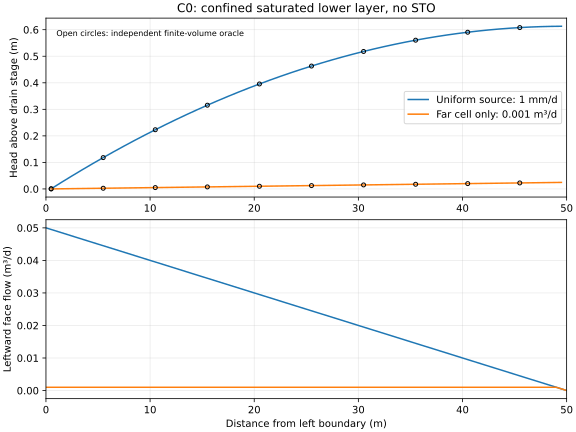
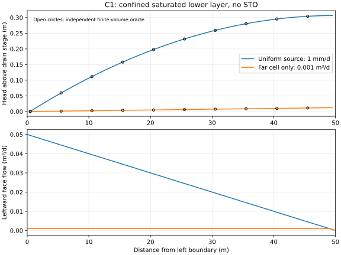

# F-GC-STRIP01 C0/C1 qualification and response findings

Status: research qualification checkpoint; coupled benchmark incomplete; no canonical admission or publication claim.

## Authority and recovery

Work branch: `work/f-gc-strip01-50m-swap-modflow-benchmark`. Baseline source is `53059a5225fa45cd6121d4bc4c7310dcc4e0660c`. Reconciliation against canonical `a9cd833092a83e0477f891989962d98d11177ade` found only an unrelated Issue 989 workflow trigger change. All 143 compiled `src/` blobs for each profile match this canonical. Source manifests are persisted beside the results. Production source, ABI, acceptance tolerances, temporal policy and bootstrap guards are unchanged.

The initial preregistration, standalone qualification, C0 domain feasibility, C0 first-window preregistration and C1 preregistration remain controlling evidence. Current recovery is `integration/f-gc/F-GC-STRIP01_STATUS.json`; the next required numerical/profile prerequisite is `integration/f-gc/strip01/F-GC-STRIP01-RESP01.json`.

## Geometry, ownership and independent oracles

Each strip has 50 cells of 1 m by 1 m, one lower aquifer layer, closed right and basal faces, and a sole left DRN boundary. The 50 m half-spacing corresponds conceptually to 100 m drain spacing. The standalone A/B convertible aquifer has its own physical storage and is qualified separately against the squared Dupuit relation and native storage balance. Those storage assumptions are not inherited into C0/C1.

| Profile | SWAP domain (m) | Confined MODFLOW domain (m) | Drain stage (m) | K (m/d) | T (m²/d) |
| --- | --- | --- | --- | --- | --- |
| C0 | 0 to -6 | -6 to -10 | -5 | 0.5 | 2 |
| C1 | 0 to -2 | -2 to -10 | -1 | 0.5 | 4 |

C0/C1 have no MODFLOW STO. All changing physical water storage belongs to SWAP. For a fully saturated confined layer, the independent steady oracle is `H(L)-H(0)=R L²/(2T)`, together with a finite-volume recurrence and the finite DRN conductance drop `sum(source)/C`. Uniform 1 mm/d supplies 0.05 m³/d: ideal rise is 0.625 m in C0 and 0.3125 m in C1. The actual drain is at the first cell center; the cell-50 rise above drain stage is approximately 0.613 m and 0.30675 m respectively. A 0.001 m³/d source in cell 50 must traverse every one of the 49 internal faces and exit at the sole drain. No SWAP column has a lateral drainage route.

In groundwater-only component tests RCHA/WEL supplies the independent imposed source. These packages are absent in the real coupled driver, where the existing interface exchange supplies the groundwater residual. The proposed whole-domain balance with no top forcing is `ΔS_SWAP + cumulative Q_DRAIN = 0`; with weather it becomes `P - ET - runoff - Q_DRAIN = ΔS_SWAP`. Interface exchange cancels internally and is not counted twice. This balance has not been qualified over an accepted coupled window.

Production remains restricted to drainage owner NONE and MODFLOW HEAD_STATE_CAPACITANCE. Generic MODFLOW drain-owner topology is structurally possible, but production bootstrap rejects it. The isolated research driver does not change that guard or admit independent physical aquifer storage. No acceptance criterion requires equality of interface head, MODFLOW head and SWAP phreatic GWL.

## Completed groundwater qualification

Selected standalone A/B is already qualified, including the 120-day drain-down: cumulative drain 16.9492406847 m³, maximum volume residual 9.1944e-12 m³. The low-K arithmetic-Dupuit negative and initial incorrect linear-Sy storage observation remain persisted.

| Native component | Uniform head error (m) | Far-source head error (m) | Largest absolute rate residual (m³/d) |
| --- | --- | --- | --- |
| C0 | 1.6343e-13 | 2.2205e-13 | 2.0373e-13 |
| C1 | 9.9921e-15 | 5.9953e-15 | 2.0373e-13 |

Both pass preregistered head 1e-8 m and rate 1e-10 m³/d gates. Right/base flow is exactly zero; no STO or CHD budget exists; all internal far-source face flows pass. C0 native persisted qualification run is [37068409553](https://github.com/abhedwig-cell/SWAP5/actions/runs/37068409553), source `1001fadcf569c936187332ccdfc213e2ce507856`, artifact 11253058393, zip SHA256 `5edf1e46b0478a8454314074ef56146416b60f4deff378b333b45fc50e044cac`. C1 was run locally with the exact same pinned MODFLOW6 6.8.0 executable and FloPy 3.9.5; its result records the executable hash. Executable SHA256 is `bae2a1099564374147702d088bdfc18ae5454ed2fe20dc9727e0c4b376f3a259`; library SHA256 is `8589fceef108757f62bb82cb2b0282562172312a75187b70ae7a06f4bd15fbf9`.

Two C0 negatives remain important. The first engine download used a nonexistent subset name and failed before numerical execution. After fixing the filename, initializing a zero-STO steady solve exactly at drain stage caused an inactive-DRN singular initial linearization for the far-source case. A stage+0.001 m initial Newton guess fixed that steady solve; it introduces no physical storage. Coupled initial state uses the actual hydrostatic origins, not this steady-component warm guess.





## Real 50-column coupling falsification

The fixture uses real canonical Richards participants, transaction/context registry, C ABI and Python groundwater application service. It is serialized, research-only and outside production bootstrap. Homogeneous B01 Staringreeks 2018 sand is source-bound to `tests/fpe/data/fpe_elastic05_staringreeks_2018.csv`: residual/saturated theta 0.02/0.42749391, alpha 0.02165898 cm⁻¹, n 1.73473668, lambda 0.98087016, Ks 31.22501566 cm/d. This is a qualified numerical soil archetype, not a field-calibrated complete BOFEK profile.

There are 60/20 nodes at 10 cm for C0/C1. Top flux is zero, with no ET, roots, macropores or snow. Initial hydrostatic water table is at drain stage except cell 50, which is raised 0.5 m. The first window is 0.001 d. Strict native head/balance limits are 1e-12, temporal history budget 1e-5 cm, maximum nonlinear iterations 16, backtracking 8, retries 8, substeps 32 and minimum step 1e-8 d. All are unchanged from preregistration.

The first predictor uses an explicitly unqualified heuristic seed hint (qbot -0.001 cm/d and inverse derivative -100 d), anchored to each cell's origin. It is neither measured accepted-origin response nor physical storage. A full real corrector is mandatory; therefore these attempts cannot qualify production predictor initialization.

Both first windows return status 6, `swap-corrector`, iteration 1, published false, requesting a smaller window. There are zero accepted windows. Fresh-process, fresh-origin replay produces exactly identical result JSON for each profile. The complete active h/theta/temporal predecessor/pond/GWL/time snapshot SHA256 is unchanged, all 50 revisions and physical storages are unchanged, all 50 ledger counts remain zero, and MODFLOW accepted XOLD is unchanged. Native calls are prepare_solve=1, solve=1, finalize_solve=0, finalize_time_step=0. The abandoned prepared session must be discarded. This establishes bounded first-rejection preservation and deterministic fresh-origin replay, not successful continuation or restart qualification.

Independent canonical backend trials reproduce rejection without MODFLOW at the offered trial head for durations 0.001, 0.0005, 0.0001 and 0.00001 d. No substep is accepted; rejection counters show solver and temporal rejections, with zero mass/admission rejections. Exact hydrostatic equilibrium controls accept a 0.001 d step with tangent enabled or disabled. A perturbed left-column trial still fails with tangent disabled. A separate corrected-origin maximum-iteration=48 control also fails. Earlier bad GWL/origin metadata configuration was repaired and its failures retained separately; it does not explain the final rejection.

## Independent Reference-floor diagnosis

The Reference-floor API correctly rejects the history-tagged carrier (status 203). A separate physical-only committed carrier and continuation-NONE template permits a genuinely independent fixed-step diagnostic. Its candidate is discarded and never substituted into the coupled transaction.

For both profiles every sampled 0.001 d fixed-step response passes, with native mass residual zero and nonzero storage/interface exchange of equal and opposite sign. At 0.00001 d the equilibrium and far-column samples pass, but the perturbed left-column sample fails with status 204 SOLVER_FAILED. Smaller steps therefore do not automatically cure this profile's numerical difficulty. The normal history-aware transaction still rejects. A temporal rejection followed by halving into a difficult solver regime is a hypothesis consistent with the counters, not a proven root cause or a universal SWAP defect.

## Remaining qualification boundary

F-GC-STRIP01-RESP01 requests source-backed qualification of dynamic accepted-origin q(H), predictor initialization and temporal/profile execution for these partially saturated columns above a fully saturated aquifer. Trace the first temporal and subsequent solver rejection, distinguish constitutive/precision, history initialization, response/tangent and policy effects, and qualify any proposed shared numerical change independently before applying it here. Do not bypass the transaction with Reference-floor candidates, widen gates, add artificial physical storage or reinterpret GWL as interface head to turn the test green.

Hupsel forcing has been recovered and date/value checked for 2002–2004, but its original B0 archive identity does not match and the current typed weather/ET binding is not qualified. Hupsel simulation, accepted-window whole-domain mass closure, timestep convergence and positive restart continuation remain unexecuted/unqualified. The benchmark stays open. No production or canonical admission is requested by this checkpoint.

## Reproduction

Use Python with FloPy 3.9.5, NumPy, xmipy and matplotlib; the pinned MODFLOW6 6.8.0 executable/library, and gfortran. From the repository root:

```bash
python tests/fgc/strip01/run_domain_native.py --mf6 /path/to/mf6 --output /tmp/strip-c0
python tests/fgc/strip01/run_domain_native_c1.py --mf6 /path/to/mf6 --output /tmp/strip-c1
python tools/build_f_gc_strip01_research_context.py --profile C0 --build /tmp/strip-build-c0
python tests/fgc/strip01/run_research_window.py --profile C0 --library /tmp/strip-build-c0/libstrip01_research.so --libmf6 /path/to/libmf6.so --output /tmp/strip-window-c0
python tests/fgc/strip01/diagnose_research_window.py --profile C0 --library /tmp/strip-build-c0/libstrip01_research.so --trial-result /tmp/strip-window-c0/result.json --output /tmp/strip-diagnosis-c0.json
python tests/fgc/strip01/diagnose_reference_floor.py --profile C0 --library /tmp/strip-build-c0/libstrip01_research.so --trial-result /tmp/strip-window-c0/result.json --output /tmp/strip-floor-c0.json
python tools/plot_f_gc_strip01_domain.py integration/f-gc/strip01/results/c0_native_component.json --output /tmp/strip-c0.svg
```

Repeat the build and diagnostics with profile C1 and separate output directories. A runner exit code 0 means execution/diagnostic completion; the result state FIRST_WINDOW_REJECTED is explicitly a negative coupled result. Never interpret it as qualification PASS.

## RESP01C — first-attempt backend telemetry

RESP01C read the backend's public observation after exactly one trial attempt (`max_retries=0`). Only isolated research fixtures and the diagnostic harness changed; production source, ABI, gates and tolerances did not.

The rerun is pinned to current canonical source head `23f5d3cff78e055426b48ec93f57c1cb9880759c`. Since the earlier `8d2271dd` reconcile, canonical tightened serialized storage completeness and made incomplete transaction storage fail closed. Both profiles were rebuilt against 143 canonical `src/` dependencies. All five changed source dependencies compiled in these fixtures match their current-canonical Git blob IDs.

**Harness correction retained in evidence:** the first C1 telemetry fixture accidentally copied C0's `head + 6 m` datum conversion instead of C1's `head + 2 m`. Its output is retained at `integration/f-gc/strip01/results/C1_telemetry_23f5d3_invalid_head_mapping.json` and is invalid for physical interpretation. The corrected C1 fixture now uses `head + 2 m`; the C0 result was unaffected.

The corrected single-attempt actual-head matrix has eight rows per profile: columns 1/50, durations 0.001, 0.0005, 0.0001 and 0.00001 d. C0 has four temporal and four solver-retry first attempts. Corrected C1 also has four of each. None has an accepted substep; mass/admission rejections are zero; committed state remains unchanged; fresh-process JSON replay is exact.

For temporal rejects, `legacy-reference-bound` converges and the `reference-richards-raw-bound` certificate is available, but exceeds the fixed `1e-5 cm` budget by about 0.67 million to 120 million times. Bounds span approximately 6.67–1196.3 cm. Solver rejects report `SW_SOLVE_RETRY_ADVISED` (status 2), route `legacy-reference-retry`, at the fixed 16-iteration limit; temporal certification is not run. The equation-residual observation is unavailable, so its default numeric zero is not evidence of zero residual. This classifies first-attempt gates; the broader coupled-window root cause remains open.

## RESP01D — actual MODFLOW trial-head response

At the actual first MODFLOW trial heads, all twelve rows per profile (columns 1/50, head offsets (-10^{-8},0,+10^{-8}) m, tangent input off/on, duration 0.001 d) exhaust the unchanged eight-retry transaction. There is no accepted exchange or published tangent, and no mass/admission rejection. Committed physical/history arrays, storage and revisions remain unchanged; fresh-process JSON replay is exact.

The first-trial heads differ materially from the SWAP hydrostatic origins in the far cell: C0 column 50 moves from (-4.5) to about (-4.9648) m; C1 moves from (-0.5) to about (-0.9743) m. The near-cell differences are about 3–5 mm. The registered finite difference is therefore unavailable at those trial heads: neither side nor center accepts. The local response tangent cannot be extrapolated across the far-cell head change.

## RESP01E — hydrostatic-origin q(H) control

A separate preregistered equilibrium-origin control uses heads C0 ((-5,-4.5)) m and C1 ((-1,-0.5)) m for columns 1/50, respectively. At each origin and at (pm10^{-8}) m, every ordinary transaction completes with the existing retry policy; committed state and temporal history remain unchanged. The exact equilibrium-head row accepts in one substep with zero exchange. No mass/admission rejection occurs.

For each profile and column, the centered finite difference of integrated bottom-outward exchange agrees with the negative of the published accepted-trajectory bottom-head derivative within 0.027–0.036%. The sign conversion is source-verified: the groundwater participant forms SWAP's inward `qbot` as `-bottom_outward_exchange / duration` and applies the same minus sign to the published integrated-exchange derivative. The tangent route is `accepted-trajectory / same-accepted-tridag-factor`, with one accepted step.

The origin response implies `qbot=0` at hydrostatic equilibrium and local `dqbot/dHbottom` about 0.2853 cm/day per cm head for column 1 and 0.19584 cm/day per cm for column 50. The corresponding inverse `dHbottom/dqbot` values are about 3.50 d and 5.11 d. The previous fixture hints `qbot=-0.001 cm/day`, inverse (-100 d), are not supported as local equilibrium responses. These measurements qualify only a local response at the accepted equilibrium origin; they do not qualify a predictor at the actual first-trial heads or a full coupled window.

RESP01C–E results, manifests, fixtures and scripts are persisted under `integration/f-gc/strip01` and `tools/f_gc_strip01_*`. No production or canonical admission is claimed. Hupsel and whole-domain coupled mass closure remain unqualified.


## RESP01F corrected matched-head rerun

The RESP01F preregistered C0/C1 fixtures accidentally retained the far-column predictor offset of +0.5 m even though RESP01F asks whether removing that perturbation permits an ordinary window. The earlier run is invalid for the registered comparison and is retained as such. The offset was removed from both research contexts; the correction and invalid-run handling are recorded in `integration/f-gc/strip01/F-GC-STRIP01_RESP01F_PREREGISTRATION_ADDENDUM.json`.

The corrected run is pinned to canonical source `a6d88c394104dfcd780d5b68df4addcb6e819968`, with exact compiled source manifests and artifact `11268969871` (workflow run [37111558449](https://github.com/abhedwig-cell/SWAP5/actions/runs/37111558449)). Both 50-column windows still return `FIRST_WINDOW_REJECTED` at `swap-corrector`, iteration 1. C0 MODFLOW trial heads are uniformly -5 m; C1 heads are uniformly -1 m. No trial is accepted, SWAP state hashes, physical storage and revisions are unchanged, all interface ledgers remain at zero, MODFLOW finalization calls are zero, and two fresh-process reruns produce byte-identical result JSON per profile. This rules out the initial MODFLOW head uplift as a sufficient explanation for the prior C0/C1 rejection; it does not establish the remaining cause. RESP01F remains a negative coupling result.

## C2a matched-head equilibrium control

C2 is a separate C1-like shallow B01 research fixture with all 50 SWAP columns, MODFLOW heads, and interface total heads initialized at -1 m; the +0.5 m far-column perturbation is removed. Its exact source build was checked against canonical commit `e3bfcdca00ba89cfeea529cf9b648dcc803483ab`. Native workflow [37111558483](https://github.com/abhedwig-cell/SWAP5/actions/runs/37111558483) completed successfully and persisted artifact `11269533858`; compact result is `integration/f-gc/strip01/results/C2a_equilibrium_run_37111558483.json`.

The 0.001 day, zero-forcing ordinary window published on the first iteration. All 50 trial and final heads remained -1 m. SWAP storage remained 0.7499125387644275 m³ per column; total storage change and drain flow are both zero, and the measured balance residual is zero. MODFLOW prepare, solve, finalize-solve and finalize-time-step each occurred once; SWAP revisions and interface ledger counts each advanced once. Thus the transaction lifecycle publishes correctly at this matched equilibrium and is internally balanced for this zero-flux window.

This single equilibrium window is not evidence for rain forcing or sustained coupling. The C2b 1 mm/day surface-forcing window and explicit C2a-to-C2b continuation remain outstanding. The discrepancy between C2 acceptance and C1 rejection implicates other fixture/profile/predictor details beyond head matching alone; it does not identify which one. The coupled benchmark remains unqualified, and Hupsel, multiwindow closure, timestep consistency, restart continuation and canonical admission remain open.
