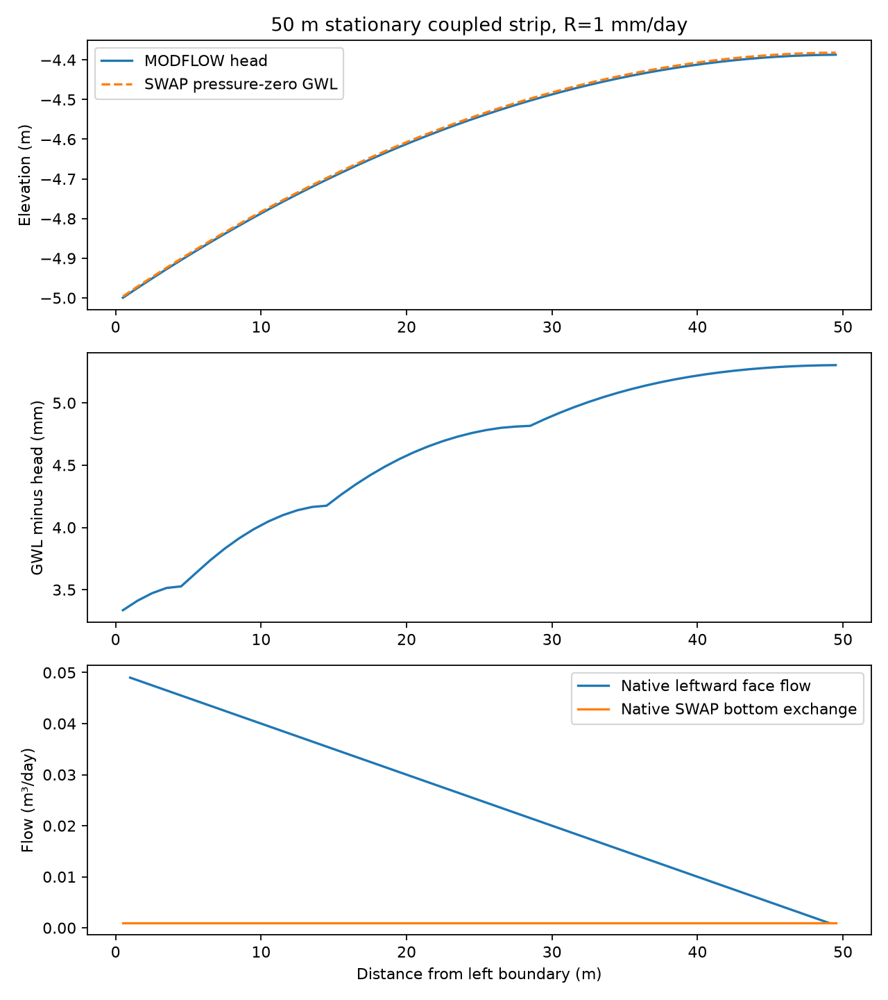
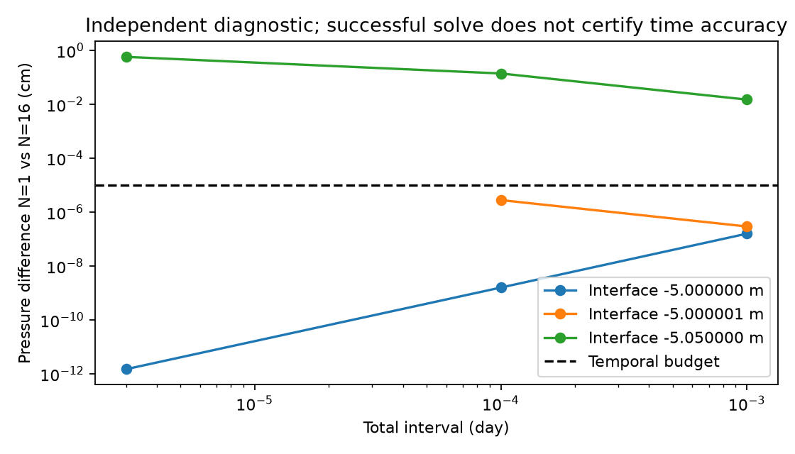
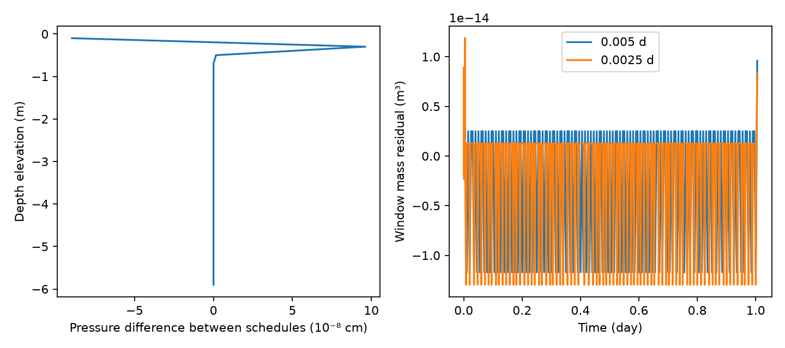

# F-GC-STRIP01 — stationary transfer and bounded temporal qualification

Research result, 2026-10-02. No canonical admission. This extends the [A/B result](F-GC-STRIP01_RESULT.md) and [component result](F-GC-STRIP01_COMPONENT_RESULT.md); their failures remain valid for their original configurations. The whole A–E workunit is not complete.

## Qualification achieved

The real, native SWAP Reference Richards participant and MODFLOW6 6.8.0 now pass a stationary 50-column transfer test at the **original strict numerical settings**, without the optional rate, Newton-increment or MODFLOW residual allocations. Ten accepted 0.1-day windows transfer 0.05 m³ of rain to the left drain. The maximum coupled window mass residual is 4.54845e-15 m³. Native MODFLOW FLOW-JA-FACE records independently confirm the expected leftward flux at every one of the 49 intercell faces: maximum discrepancy 1.53350e-15 m³/day. Cell 50 has only cell 49 as an off-diagonal hydraulic neighbor; the right boundary is closed.

Disconnecting only the API source for cell 50 while retaining its positive real SWAP exchange produces PRE_PUBLICATION_EXCHANGE_MISMATCH (0.001 m³/day), zero accepted windows, unchanged committed origins and identical replayed exchange. This negative test establishes detection before publication. It is not a test of full durable restart or the production interface ledger.

Two dry-start native coupled runs reach 1.005403 days using 210 and 410 windows, with a common short warmup followed by 0.005 and 0.0025-day windows. Their final complete pressure profiles differ by at most 9.62512e-8 cm, below the frozen 1e-5 cm temporal comparison budget. Maximum window mass residuals are 1.18689e-14 and 1.29604e-14 m³. These runs use the separately declared numerical allocation variants below. Almost all rain remains in SWAP: drain volume is about 6.86e-13 m³. They establish bounded dry-start window consistency, **not** dynamic far-column drainage or Hupsel qualification.

## Domain, independent initialization and water balance

The [research domain](F-GC-STRIP01_RESEARCH_DOMAIN.md) remains explicit: 50 land cells of 1 m by 1 m; SWAP owns 0 to −6 m, represented by 30 uniform 20 cm cells. One confined MODFLOW layer owns −6 to −10 m, with Kx=0.5 m/day, T=2 m²/day, Ss=1e-5/m and Sy=0. SWAP physical elasticity is 1e-7/cm. These storage domains do not overlap. The sole lateral sink is a left MODFLOW DRN at −5 m with conductance 100 m²/day. There is no SWAP lateral drain and no MODFLOW RCHA in the coupled run.

Per window, with outward drain volume positive and both storage increments positive for accumulation:

\[
0.001(50)(\Delta t)-V_{DRN}=\Delta S_{SWAP}+\Delta S_{MF}.
\]

Internal SWAP-bottom/API exchange cancels. SWAP storage includes its native physical compressibility; MODFLOW storage is \(4\times10^{-5}\sum_j(H_j^{new}-H_j^{old})\) m³. No ET, runoff or surface storage change is active in these cases. This balance does not stand in for a future Hupsel balance with those processes.

The independent confined finite-volume steady oracle sets H₀=−5+50R/C=−4.9995 m and Hⱼ−Hⱼ₋₁=(50−j)R/T for j=1…49, R=0.001 m/day. H₄₉=−4.387 m, so the stationary mound is 0.6125 m. This **confined disjoint-domain C oracle differs from the unconfined Dupuit A oracle**; compare each solver only with its matching assumptions.

`steady_transfer.py` computes SWAP initial pressures by scalar vertical Darcy bisection, independently of the Richards time solver, using the already qualified constitutive provider and arithmetic face conductivity. Every face carries 0.1 cm/day; maximum independent face residual is 3.91215e-14 cm/day. Native accepted SWAP bottom exchange differs from 0.001 m³/day by at most 5.68426e-15. Native MODFLOW heads differ from the steady oracle by at most 1.77636e-15 m. Steady temporal history starts at zero, consistent with stationary forcing.

This demonstrates the sustained far-cell vertical-to-horizontal-to-drain route. It does not trace the travel time of newly applied individual water parcels through the initialized steady reservoir.

## GWL, interface head and diagnostic ownership

Stationary pressure-zero SWAP GWL lies 3.335–5.303 mm above MODFLOW/interface head. Downward flow through saturated sand explains the main offset: with r=0.1/Ksat and Ksat=31.225016 cm/day, continuum GWL=(H+6r)/(1−r). A first attempted exact comparison of node-interpolated GWL with this continuum expression failed: maximum discrepancy 0.121434 mm. The crossing face uses one unsaturated node and arithmetic face conductivity, so the **discrete oracle** requires the corresponding interpolation correction. With that analytically derived correction, error is 1.44683e-15 m. The continuum comparison was repaired mathematically; its original failed expectation is recorded here, rather than widening its threshold.

A separate dynamic diagnostic exposes a readout ownership gap in the selected plain Reference path. `mod_reference_richards_state_binding.f90` initializes GWL from the base state; the HeadCalc path used here does not refresh it, and the selected bottom-mode-5 path does not enter the special drainage freatic projection. At dt=0.001 day, interface −5.05 m, 16 diagnostic subdivisions, the carried field remains −5.0 m while the accepted pressure-zero interpolation is −5.006532803573434 m. These diagnostics are not temporally admitted trajectories. This is evidence about the **selected raw participant path**, not a claim that every higher-level production SWAP postprocessing path has stale GWL. The harness records the carried field separately and does not modify production state. A future dynamic Hupsel plot must use an explicitly owned, refreshed diagnostic; copying MODFLOW head into GWL would hide the problem.

## Numerical falsification and repairs

The [refinement preregistration](F-GC-STRIP01_REFINEMENT_PREREGISTRATION.md) separates these experiments from physical qualification. Three 44-case independent floor panels complete 18, 33 and 43 cases respectively. Each uses a fresh process and leaves all coupling origins unchanged. A completed nonlinear solve is not temporal admission.

1. The native balance residual is a rate (cm/day), while the research mass budget was specified as a depth (1e-12 cm). The opt-in rate allocation uses total 1e-12/dt and local 1e-12/(30dt). The native reference floor of 2.8e-16 cm divided by dt also remains active. Independent transaction mass remains bounded at 1e-12 cm.
2. The optional Newton increment stopping allocation uses absolute 1e-8 cm and relative 2e-11, with completed pressures bounded by 500 cm. Its nominal increment allocation is 0.001 of the temporal head budget. This is an explicit changed stopping configuration, **not** a rigorous cumulative nonlinear error bound. Independent trajectory comparison remains necessary.
3. MODFLOW stalled at the original 1e-12 m³/day inner residual threshold despite interface mismatch around 1e-18, head corrections around 1e-15 m and an inner residual floor near 1.33e-12. Translating its vertical datum by +5 m and switching BICGSTAB to native CG, separately and together, did not repair this. All failed configurations are preserved.
4. The optional MODFLOW residual allocation is RCLOSE=4e-14/dt. The confined matrix storage dominance gives a conservative head-error bound 1e-9 m and summed integrated residual budget 2e-12 m³, below the unchanged 1e-8 m³ coupled window budget. Each native solve is also compared with a 50×50 independent dense LU solve using actual published API coefficients and a branch-consistent DRN. Observed differences are about 5e-12 m. This changes the inner numerical threshold; it is not presented as unchanged tolerance.

The completed fixed-interface refinements have pressure differences around 1.58e-9 cm at dt=1e-4 and 1.58e-7 cm at dt=1e-3. For an imposed 5 cm head drop, N=1 versus N=16 differences remain 0.576536, 0.139412 and 0.0149602 cm at dt=3e-6, 1e-4 and 1e-3 day: all exceed 1e-5 cm. The one remaining nonlinear panel failure is dt=3e-6, head=−5.000001 m, N=16.

After 210 accepted dry-start windows, adding a 0.01-day window fails at the frozen 32 accepted-substep ceiling, with zero solver rejections and 152 temporal rejections. A previously shorter variable schedule also fails when stepping to 0.01 day. Accepted-prefix mass closure does not qualify either failed requested trajectory. Retry and substep ceilings, temporal and physical mass budgets were not enlarged to make those cases pass.

## Reproduction and persisted evidence

The archive `integration/f-gc/strip01/evidence/refinement_C_20261002.tar.gz` retains raw native inputs, heads and cell budgets, logs, JSON profiles, solver diagnostics, negative runs and source manifests. Its checksum is in `integration/f-gc/F-GC-STRIP01_STATUS.json`. Historical A/B and first C archives remain intact. Compiler binaries and MODFLOW binaries are excluded; use the pinned MODFLOW6 6.8.0 distribution and existing acquisition instructions. GNU Fortran 13.3, Python 3.12.14, Flopy 3.9.5 and xmipy 1.5.0 were used locally. No GitHub Actions were dispatched.

From the repository root, with the exact compiler executable and MODFLOW shared library available:

```sh
python tests/fgc/strip01/build_research.py --compiler "$STRIP01_FC" --output "$STRIP01_BUILD"
OMP_NUM_THREADS=1 OPENBLAS_NUM_THREADS=1 python tests/fgc/strip01/run_refinement_qualification.py --swap-library "$STRIP01_BUILD/libstrip01_swap.so" --mf-library "$STRIP01_MF_LIB" --output "$STRIP01_RUN"
python tests/fgc/strip01/analyze_refinement.py --evidence "$STRIP01_RUN" --output "$STRIP01_RUN/figures"
```

For a compact strict stationary positive/negative rerun, add `--static-only` to the runner. For archived analysis alone, extract the archive and pass its evidence directory to `analyze_refinement.py`. The runner reproduces the main refinement, stationary, day-comparison and negative controls; auxiliary print-only IMS/HeadCalc diagnostics and earlier exploratory schedules are retained evidence, not silently required by the compact runner.







## Remaining work and admission boundary

A/B qualification is retained. C now has a genuine stationary far-column transfer proof and a bounded one-day dry-start temporal comparison. It does not yet qualify general dynamic forcing changes. D/Hupsel and durable E/restart continuation remain unexecuted and unqualified. In-memory replay and rejection checks are narrower than durable continuation and publication crash recovery. The isolated research harness uses current materializer/prepared-solve semantics, while production drainage/storage guards and ABI remain unchanged.

Next useful work is to reconcile pressure-zero diagnostic ownership with the selected native path, preregister physically dynamic forcing transitions and suitable window costs, then implement full existing Hupsel meteorology with explicit ET/runoff/surface storage ownership. Restart must use committed state and a complete research checkpoint rather than reconstructing only head and storage totals. No paper or canonical-admission claim follows from these observations.
