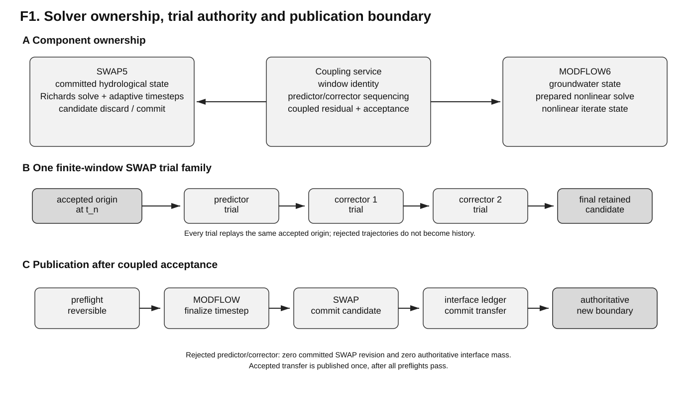
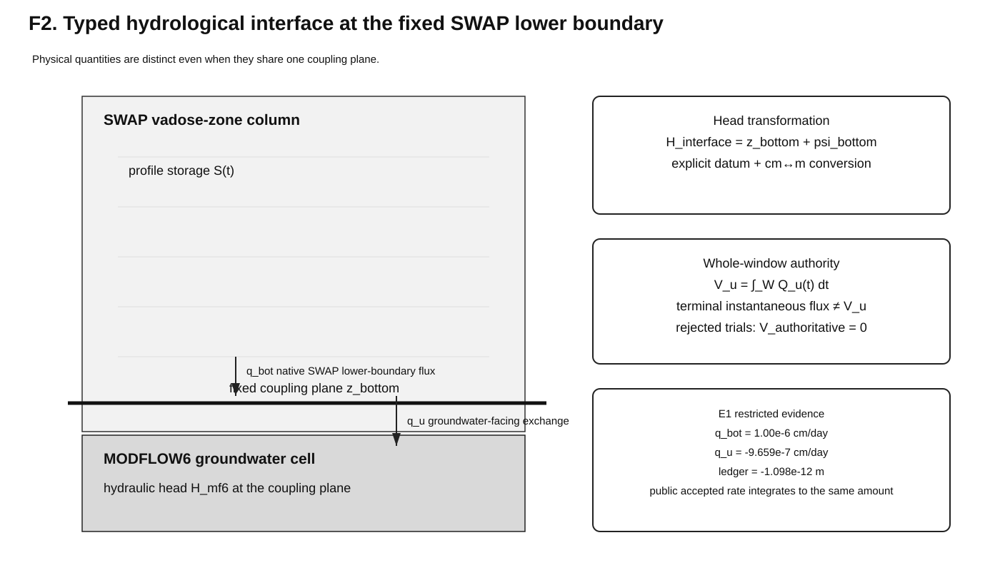
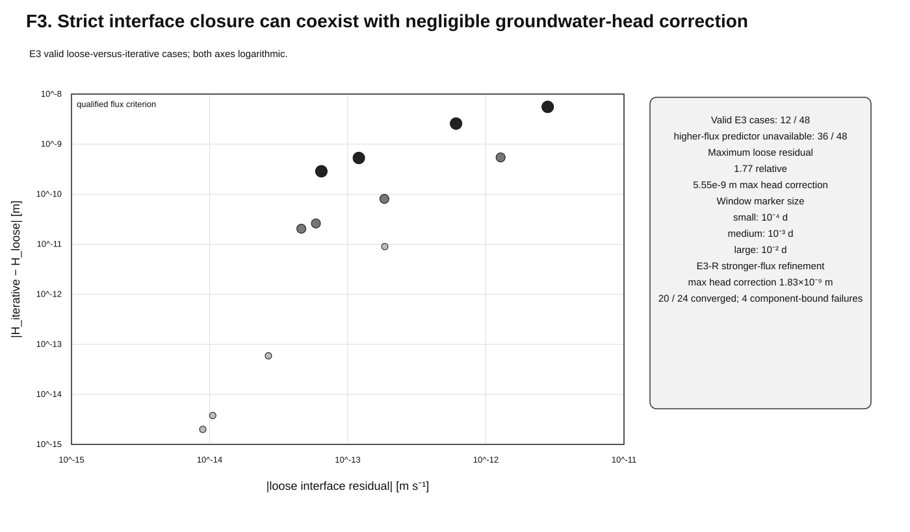
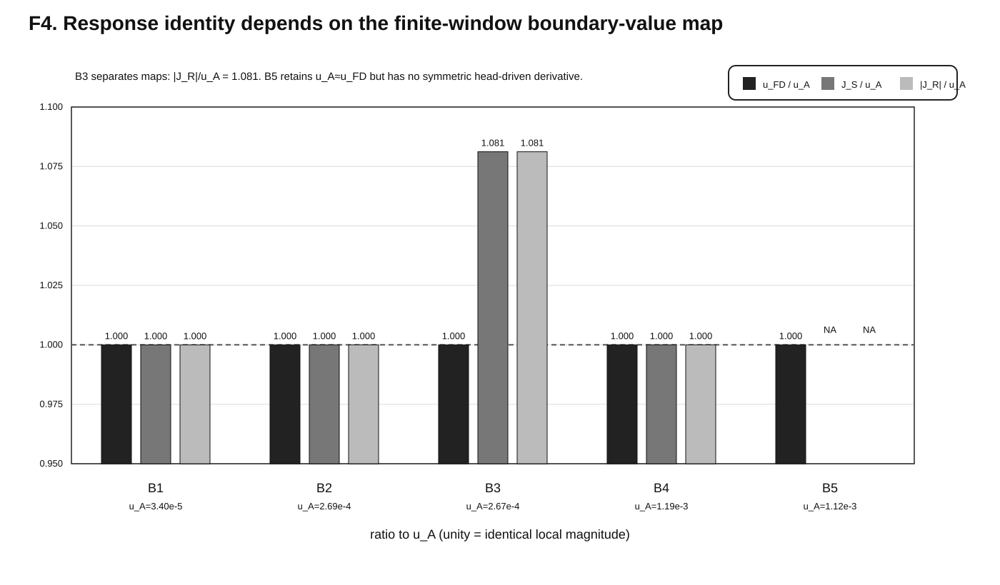
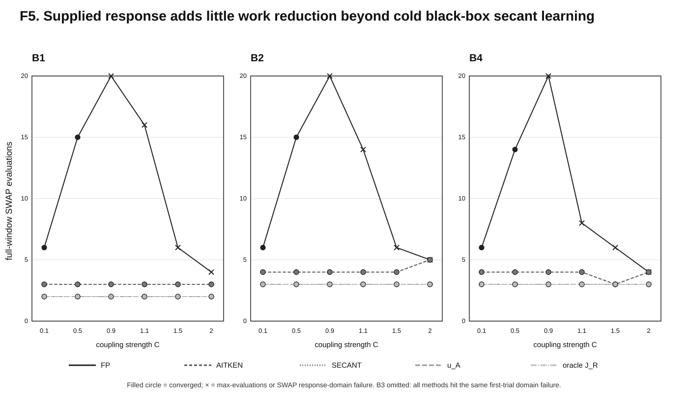
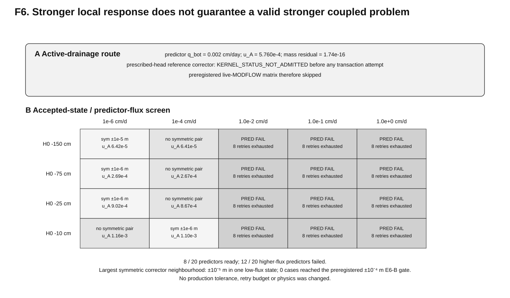
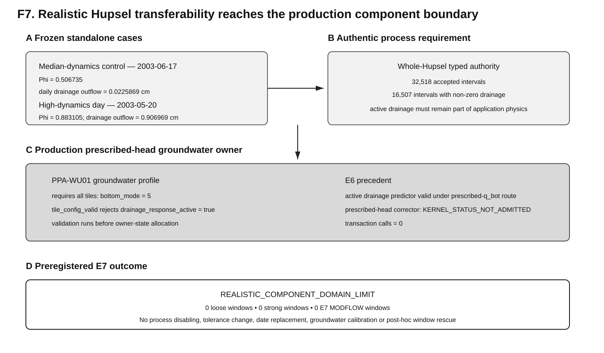

# COUPLE — manuscript draft

## Title

**Hydrologically accountable finite-window coupling of independently time-integrating vadose-zone and groundwater models: SWAP5–MODFLOW6**

## Repository manuscript status

**Consolidated through E1–E7; E7 closed as a preregistered realistic component-domain limit, 2026-09-18.**

### Editorial handoff — fixed-interface theory (2026-09-23)

The closed SWAP5–MODFLOW6 fixed-interface theory has been transferred explicitly into
this publication line in
`docs/publication/PUB_GC_COUPLE_FIXED_INTERFACE_THEORY_HANDOFF.md`.
The next substantive manuscript revision should present the complete current method as
the primary formulation: finite-window predictor/corrector coupling, physical
accepted-trajectory tangent, corrector relinearization, explicit storage/process
ownership and transaction-safe state authority. The earlier SWAP4–MODFLOW6 process
report is treated as development history rather than as the prior scientific
publication that constrains this paper's novelty framing. External novelty claims
remain subject to literature review.

The scientific text below is written as a manuscript rather than as a workplan. E7 is reported as a bounded negative realistic-transferability result rather than as an unexecuted future experiment. Repository evidence pointers and readiness notes are retained after the references and are not intended for journal submission.

---

## Abstract

Coupling a process-based vadose-zone model to a groundwater model requires more than exchanging recharge and groundwater head. Repeated within-window coupling trials must preserve component state authority, exchanged quantities must retain unambiguous hydrological meaning, and only the accepted transfer may enter the water balance. We present a solver-autonomous finite-window coupling contract for SWAP5 and MODFLOW6 in which each component retains its own solver and internal time integration. SWAP5 predictor and corrector evaluations replay one coupling window from an immutable accepted origin, MODFLOW6 remains within one prepared nonlinear solve, and interface mass becomes authoritative only after coupled acceptance and ordered publication.

In a controlled real SWAP–MODFLOW6 end-to-end case, native lower-boundary flux and groundwater-facing exchange were demonstrably distinct, rejected trials changed neither committed SWAP state nor interface mass, and the accepted whole-window transfer was published exactly once. Iterative coupling reduced interface residuals below the fixed interface criterion in two to five outer iterations, but the largest loose-to-iterative groundwater-head correction in the controlled low-flux experiments was only 5.55×10^-9 m. A stronger-flux refinement remained similarly weak before the SWAP predictor or prescribed-head corrector envelope became limiting. Independent response experiments identified the supplied SWAP coefficient as a finite-window flux-driven predictor response, u_A ≈ ΔT(∂H_end/∂q_bot)^-1, rather than a universal head-to-exchange Jacobian. In one baseline the actual head-driven response magnitude was 8.1% larger. A zero-cost exact local derivative then saved only one SWAP evaluation in 16 of 18 comparable cases relative to a cold black-box secant method and did not enlarge its convergence domain.

Two preregistered attempts to construct a stronger synthetic hydrological-feedback case subsequently reached component-admission boundaries before a positive live-coupling case was available. A prospectively selected three-year Hupselbrook application then reached the same class of boundary under authentic forcing and process composition: both frozen test days had active drainage, whereas the current production prescribed-head groundwater owner rejects profiles with active drainage before owner state is allocated. E7 therefore closed as a `REALISTIC_COMPONENT_DOMAIN_LIMIT` with no loose or strong coupled window executed and no numerical or physical policy relaxed. These results show that component admissibility, interface semantics, coupled convergence and hydrological relevance are distinct parts of the coupling problem. The contribution is therefore a conservative hydrological coupling contract, not a new nonlinear solver.

---
# 1. Introduction

## 1.1 Why vadose-zone–groundwater coupling remains difficult

The vadose zone and groundwater form one hydrological system, but they are commonly simulated with models that were developed for different spatial scales, process detail and numerical time scales. A one-dimensional vadose-zone model may resolve infiltration, evaporation, root-water uptake, capillary rise and rapidly changing vertical hydraulic gradients using short, adaptive internal timesteps, whereas a regional groundwater model integrates saturated flow over larger spatial domains and typically evolves on a coarser temporal grid. Coupling these models is therefore not equivalent to passing one recharge value downward and one groundwater level upward.

Three classes of difficulty are intertwined.

First, the exchanged quantities must have an unambiguous physical meaning. The hydraulic flux across the fixed lower boundary of a vadose-zone column need not be identical to the effective recharge or exchange quantity seen by a groundwater model over the same interval. Storage change within the part of the profile represented by the vadose-zone model can contribute to the groundwater-facing exchange. Hydraulic head, pressure head and groundwater-table depth are likewise related but non-identical variables and require an explicit vertical datum.

Second, the coupled problem can require nonlinear iteration. A groundwater head proposed by the saturated-zone model changes the vadose-zone solution, which changes the exchange flux, which can in turn change the groundwater solution. Sequential exchange is therefore not generally equivalent to a converged coupled solution. The severity of this feedback depends on hydrological state, hydraulic properties, coupling-window length and the numerical response of both components.

Third, iterative coupling creates a state-authority problem. If a vadose-zone model is advanced repeatedly over the same physical interval under different candidate groundwater heads, most of those trajectories are rejected coupling trials rather than accepted hydrological history. A coupling implementation must therefore distinguish computation from acceptance. The same applies to interface water transfer: a flux produced by an intermediate nonlinear iterate is not automatically an authoritative mass transfer.

These concerns become more important when independently developed models are coupled without merging their internal solvers. Such solver autonomy is attractive for maintainability and scientific traceability, but it requires a more explicit contract at the interface.

## 1.2 Existing coupling approaches provide important but incomplete precedents

Bidirectional vadose-zone–groundwater coupling is well established. HYDRUS-based MODFLOW packages have used repeated feedback between groundwater head and Richards-equation vadose-zone flow (Twarakavi et al., 2008; Zeng et al., 2019). SIMGRO/MetaSWAP uses shared hydrological state and dynamic storage relations to couple unsaturated and saturated response (van Walsum & Veldhuizen, 2011), while transient shallow-water-table specific yield is itself time- and depth-dependent hydrological behaviour (Nachabe, 2002). More recent integrated-model developments likewise demonstrate that cross-component hydrological coupling and large-scale composition are established modelling problems rather than new ideas in themselves (Bailey et al., 2025; Abbaszadeh et al., 2025; Yang et al., 2026).

Generic modelling and interoperability frameworks address another part of the problem. OpenMI provides formal exchange and temporal/spatial mapping concepts for independently developed environmental models (Buahin & Horsburgh, 2018), while the MODFLOW6 application-programming interface permits external control of simulation state and nonlinear solution without source-code fusion (Hughes et al., 2022). Recent SUMMA refactoring work likewise frames fine-grained initialize–update–finalize modularity as a route to hydrologic component reuse and interoperability (Trim et al., 2025). FMI provides analogous component-state and co-simulation concepts at a general systems level (Modelica Association Project FMI, 2024).

Partitioned multiphysics literature supplies a third set of precedents. Fixed-point iteration, Aitken relaxation, interface quasi-Newton methods, interface-Jacobian approaches and waveform iteration are established tools for accelerating coupled nonlinear systems (Degroote et al., 2010; Sicklinger et al., 2014; Rüth et al., 2021). Surrogate or previously available response information has likewise been used to initialize or accelerate black-box quasi-Newton coupling (Delaissé et al., 2022). Recent analysis of surface–subsurface iteration also shows that convergence behaviour depends on the response of both coupled subsystems and cannot be inferred from one model alone (Schüller et al., 2025).

These precedents remove several broad novelty claims. Solver autonomy, rollback, iterative coupling, dynamic storage response, interface derivatives and multirate finite-window iteration are not individually new. The scientific question addressed here is narrower: whether these ingredients can be assembled into a hydrologically explicit contract in which physical exchange meaning, finite-window component response, model-state authority and interface mass authority remain simultaneously testable while the two models retain numerical ownership.
## 1.3 The coupling gap addressed here

Many legacy hydrological couplings are scientifically useful but tightly bound to the internal implementation of the participating models. This can create long-term maintenance problems when one component evolves independently. At the other extreme, generic coupling frameworks deliberately abstract away domain-specific meaning and therefore cannot by themselves decide whether two exchanged arrays represent the same physical quantity, whether a trial flux should enter a water balance, or whether a component-specific storage response is an admissible approximation to the actual interface response.

The gap addressed in this study lies between these two traditions.

We seek a coupling method in which:

1. each hydrological model retains ownership of its internal state, solver, adaptive timestepping and process physics;
2. the coupler owns only the coupled iteration and the interface contract;
3. every repeated vadose-zone evaluation over one coupling window starts from the same accepted hydrological origin;
4. exchanged variables retain explicit hydrological semantics, including datum, sign, area and time support;
5. coupled convergence is distinguished from component convergence;
6. only the final accepted coupled state contributes authoritative interface mass;
7. optional response information can be exposed without transferring the component's internal Jacobian or time-integration algorithm to the coupler.

This combination is referred to here as **solver-autonomous, hydrologically accountable finite-window coupling**.

The phrase is descriptive rather than a claim that the underlying numerical ingredients are fundamentally new.

## 1.4 SWAP5 and MODFLOW6 as the test system

SWAP5 is a restructured successor of the SWAP vadose-zone model in which model state, trial calculation and state acceptance are explicitly separated. MODFLOW6 provides a modern groundwater platform with an external application-programming interface that supports repeated nonlinear solution within a prepared timestep.

This combination creates a useful test system. SWAP5 can replay one coupling window repeatedly from an immutable accepted checkpoint while preserving its own internal Richards solution and adaptive timestep control. MODFLOW6 can remain within one prepared nonlinear solve while the coupling service updates the groundwater-facing boundary response between nonlinear iterations.

The coupling plane is the fixed lower boundary of the SWAP column. Hydraulic head is the shared state variable at this plane, but the coupling method distinguishes the native SWAP lower-boundary flux from the effective exchange seen by MODFLOW6. This distinction is central because a numerically convenient interface is not necessarily a physically correct interface.

## 1.5 Contributions of this study

The contribution is methodological and hydrological rather than the invention of a new nonlinear algorithm.

First, we formalize a coupling contract that separates **component numerical ownership** from **coupled-iteration ownership**. SWAP5 retains its adaptive internal integration and candidate-state machinery; MODFLOW6 retains its prepared nonlinear solve; the coupling service owns only the finite-window interaction.

Second, we make the hydrological interface typed rather than implicit. Hydraulic head, the native SWAP lower-boundary flux, the groundwater-facing exchange, finite-window response information and the accepted integrated transfer are distinct quantities with explicit sign, datum, units, temporal support and provenance.

Third, we define **state authority** and **mass authority** as part of the scientific coupling contract. Repeated predictor and corrector trajectories are alternative trial histories from one accepted origin; rejected trajectories contribute neither committed SWAP state nor authoritative interface mass.

Fourth, we distinguish the response of the flux-driven SWAP predictor map from the response of the head-driven coupled corrector map. This permits the value of extra response information to be measured rather than assumed.

Fifth, we evaluate the contract with falsifiable negative controls. The experiments explicitly allow weak feedback, component-domain failure and lack of derivative advantage as valid outcomes. This prevents numerical convergence, local sensitivity or software capability from being promoted automatically into hydrological importance.

The evidence supports these contributions across bounded controlled experiments and one prospectively selected realistic application. The Hupselbrook result is negative in a precise sense: authentic process composition reaches the current prescribed-head participant boundary before loose-versus-strong convergence can be evaluated. Regional scaling and physical aggregation validity are not claimed from this result.
## 1.6 Research questions

The central research question is:

> Can a vadose-zone model and a groundwater model be coupled over finite windows while each retains ownership of its internal numerical solution, and while interface meaning, trial-state authority and accepted mass publication remain hydrologically explicit?

Four evidence questions structure the present paper, followed by one external-validity question.

**RQ1 — Interface and authority.**  
Can hydraulic head, native lower-boundary flux, groundwater-facing exchange and whole-window transfer be distinguished consistently, while rejected trials leave committed state and interface mass unchanged?

**RQ2 — Coupled convergence and relevance.**  
When valid component candidates exist, how much does within-window iterative coupling change algebraic interface closure, groundwater head and transferred water relative to a loose/sequential pass?

**RQ3 — Response identity and information value.**  
What finite-window map is represented by the response exposed by SWAP, how does it differ from the actual head-to-exchange response, and how much computational value does supplied response add over black-box learning?

**RQ4 — Component-envelope interaction.**  
Can stronger hydrological states or processes create a materially stronger valid coupled problem without changing production tolerances or numerical policy, or does component admissibility become limiting first?

**RQ5 — Realistic transferability.**  
Does the same coupling contract remain usable and interpretable in an independently authoritative real application with authentic forcing and process composition?

RQ1–RQ4 are addressed by E1–E6. RQ5 is addressed by E7 in a bounded negative form: under authentic Hupsel forcing and drainage composition, the current production prescribed-head participant cannot be instantiated without dropping an active process, so component admission becomes limiting before loose-versus-strong convergence can be assessed. Multi-column execution is an implementation/scaling question; the physical validity of spatial aggregation is outside this manuscript and belongs to the separate SCALE research line.

---
# 2. Coupling method

## 2.1 Ownership model

The coupling is partitioned. Neither model becomes a numerical subroutine whose internal solve is owned by an external master.

The ownership hierarchy is:

```text
coarse model orchestration
        |
        v
internal SWAP5-MODFLOW6 coupling service
        |
        +--> SWAP5 transactional participant
        |
        +--> MODFLOW6 prepared-solve participant
```

The coarse orchestrator decides when a coupled model interval is requested. Predictor/corrector logic remains below this level because it is part of the scientific coupling contract rather than generic workflow orchestration.

SWAP5 owns:

- its committed hydrological state;
- its internal process physics;
- the Richards solve and internal temporal discretization;
- candidate generation from a checkpoint;
- candidate discard and commit.

MODFLOW6 owns:

- groundwater state;
- the groundwater equations and nonlinear solver;
- the prepared timestep and prepared nonlinear solve;
- internal nonlinear iterate state.

The coupling service owns:

- the common coupling-window identity;
- construction and use of the SWAP coupling response;
- sequencing of MODFLOW and SWAP evaluations;
- the coupled convergence criterion;
- hand-off to whole-window publication.

This separation is a design requirement. The coupler is not allowed to reimplement SWAP-specific timestep, retry or Richards-solver logic.



**Figure 1. Solver ownership, trial authority and publication boundary.** SWAP5 and MODFLOW6 retain component state and solver ownership. Replayed SWAP trials originate from one accepted state, while only the retained converged candidate crosses the ordered publication boundary.

## 2.2 Coupling window

Coupling is defined over a finite interval

```text
W = [t_n, t_{n+1}]
```

with duration `DeltaT`.

The interval is a communication and acceptance window, not an internal numerical timestep. SWAP5 may use multiple adaptive internal timesteps inside W. MODFLOW6 may perform multiple nonlinear iterations for the same groundwater timestep.

This distinction allows communication frequency to be varied without requiring both models to adopt a common internal timestep.

## 2.3 Fixed coupling plane and head transformation

The coupling plane is the fixed lower boundary of the SWAP soil column.

The shared state is hydraulic head at that plane:

```text
H_swap,bot = H_mf6
```

after explicit datum translation.

SWAP internally uses pressure head relative to the lower-face elevation. If `z_bottom` is the elevation of the coupling plane and `psi_bottom` is pressure head, then:

```text
H_interface = z_bottom + psi_bottom
```

with unit conversion applied explicitly where SWAP uses centimetres and the public coupling contract uses metres.

This equality does not imply that the MODFLOW hydraulic head is identical to a diagnostic phreatic water-table elevation inside SWAP. SWAP may resolve an unsaturated or saturated vertical profile between the fixed lower boundary and the location where pressure head is zero.

## 2.4 Distinct exchange quantities

The method distinguishes at least four quantities.

### 2.4.1 Native SWAP lower-boundary flux

`q_bot` is the hydraulic flux across the fixed SWAP lower boundary. It is a native lower-boundary quantity and can be prescribed during predictor trials.

### 2.4.2 Groundwater-facing exchange

`q_u` is the effective exchange supplied to the groundwater system.

In general:

```text
q_bot != q_u
```

because storage change represented inside the SWAP domain can contribute to the groundwater-facing transfer.

The public sign convention is normalized explicitly. A positive `q_u` denotes transfer from SWAP toward groundwater; any native SWAP or MODFLOW sign convention is translated by the relevant adapter.

### 2.4.3 Finite-window response information

The SWAP predictor can expose a local response quantity together with its reference state. The publication experiments identify this quantity as a response of the flux-driven finite-window predictor map rather than assuming that it is the derivative used by the head-driven corrector.

Let

```text
H_end = P_W(q_bot)
```

denote the terminal head produced by a complete SWAP predictor over window W under prescribed bottom flux. The accepted-trajectory response is denoted `u_A`. E4 independently tests the relation

```text
u_A ~= DeltaT * (dH_end/dq_bot)^(-1).
```

For local groundwater coupling, the response may be represented in affine form around a reference head,

```text
q(H) = q_ref + s (H - H_ref),
```

with the slope constructed from the active finite-window response contract and its explicit sign/unit transforms.

A different object is the head-driven whole-window exchange derivative,

```text
J_R = dV_u/dH.
```

No equality between `u_A` and `J_R` is assumed by the method. Their relation is an empirical question because the two derivatives belong to different finite-window boundary-value maps.
### 2.4.4 Whole-window transfer

The authoritative interface transfer is the accepted amount integrated over the complete coupling window:

```text
V_u = integral_W Q_u(t) dt
```

A mean rate may be derived as:

```text
Q_u,mean = V_u / DeltaT
```

but a terminal instantaneous flux is not silently substituted for the whole-window amount.

This distinction is required for consistent mass accounting across retries and accepted publication.



**Figure 2. Typed hydrological interface at the fixed SWAP lower boundary.** Native lower-boundary flux, groundwater-facing exchange, hydraulic head, storage and whole-window authoritative transfer are represented as distinct quantities with explicit sign, datum and time support.

**Table 1. Hydrological quantities in the finite-window coupling contract.** A trial value can be physically meaningful without being authoritative model history.

| Quantity | Hydrological role | Representation / time support | Authority |
| --- | --- | --- | --- |
| `H_interface` | hydraulic head at the fixed SWAP lower plane | public head in metres after explicit datum/unit transformation; candidate or accepted end-of-window value | trial head is not committed state |
| `q_bot` | native SWAP hydraulic flux across the fixed lower boundary | native flux, commonly reported here in cm d⁻¹; evaluated within a finite window | computed trial flux is not authoritative mass |
| `q_u` | groundwater-facing effective exchange | sign/unit-normalized finite-window exchange; distinct from `q_bot` | tentative until coupled acceptance |
| `u_A` | response of the prescribed-flux predictor map | `u_A ≈ ΔT(dH_end/dq_bot)⁻¹`; local to one accepted origin and window | optional response information, not a transferred mass and not universally `J_R` |
| `J_R` | prescribed-head whole-window exchange derivative | `dV_u/dH` where a symmetric local response is available | unavailable outside a valid symmetric head-response neighbourhood |
| `V_u` | integrated accepted interface transfer | complete coupling-window water amount after sign/unit normalization | authoritative only after ordered publication and ledger commit |

## 2.5 Accepted origin and SWAP trial semantics

At the beginning of a coupling window, the coupling service captures one immutable accepted SWAP origin.

Conceptually:

```text
committed SWAP state at t_n
        |
        v
capture checkpoint
        |
        +--> predictor trial
        +--> response/tangent trial(s)
        +--> corrector 1
        +--> corrector 2
        +--> ...
```

Every SWAP evaluation for this coupling window starts from the same checkpoint.

A corrector is therefore **not** the continuation of the preceding predictor or corrector. It is an alternative candidate trajectory over the same physical interval.

The production SWAP participant implements this through the existing SWAP5 transaction machinery:

```text
kernel committed state
    -> capture checkpoint
    -> advance interval from checkpoint
    -> candidate state
       -> discard candidate
       or
       -> non-mutating publication preflight
       -> commit candidate
```

Only the final accepted candidate may mutate committed SWAP state.

## 2.6 Predictor response

At the start of a coupling window, SWAP executes a predictor from the accepted origin and exposes a reference terminal head, groundwater-facing exchange and finite-window response. The response used in the current production route is an accepted-trajectory analytic quantity with provenance tied to the accepted origin and exact window.

For independent response characterization, E4 also constructs a centred prescribed-flux finite difference,

```text
u_FD =
    ((q_2 - q_1) * DeltaT) /
    (H_2 - H_1),
```

where `q_1` and `q_2` are symmetric bottom-flux perturbations and `H_1` and `H_2` are the corresponding terminal heads. A governed perturbation sequence is used to identify a stable local plateau rather than accepting one arbitrary finite-difference step.

The predictor response is therefore exposed as optional component information, not as access to the internal Richards Jacobian, Newton iterations or SWAP timestep controller. The coupling service may use this response, ignore it and learn a secant response from black-box evaluations, or compare the two under one common convergence criterion.
## 2.7 MODFLOW6 prepared-solve lifecycle

The MODFLOW6 participant uses one prepared nonlinear solve per coupling window.

The qualified lifecycle is:

```text
prepare_time_step

prepare_solve
    XOLD <- accepted previous-time head

    solve iteration 1
    update coupling response
    solve iteration 2
    update coupling response
    ...
finalize_solve
```

`XOLD` remains the accepted previous-time groundwater head while `X` evolves as the nonlinear iterate.

This is important for the coupling transaction model. MODFLOW6 is not rolled back to the beginning of the timestep after every coupling iteration. Instead, SWAP correctors are replayed from the immutable SWAP origin while MODFLOW remains inside one prepared nonlinear solve.

The two participants therefore have different internal iteration semantics but share one coupling-window acceptance decision.

## 2.8 Coupled corrector iteration

Let the current affine SWAP response be:

```text
q_gw(H) = q_ref + s (H - H_ref)
```

At coupled iteration `k`:

1. publish the current affine response to MODFLOW6;
2. execute one MODFLOW nonlinear solve iteration;
3. obtain current groundwater head `H_k` and the realized groundwater-facing affine boundary flux `q_gw,k`;
4. run a SWAP corrector over the complete coupling window from the immutable accepted origin with `H_k` prescribed at the coupling plane;
5. obtain the corresponding SWAP exchange `q_swap,k`;
6. compute the coupling residual

```text
r_q,k = q_swap,k - q_gw,k
```

If the coupled criterion is not satisfied, the SWAP candidate is discarded. MODFLOW remains in its prepared solve, and the affine reference is updated using the latest SWAP response while the qualified slope policy is retained or refreshed according to the active response contract.

## 2.9 Coupled convergence

Component convergence is necessary but not sufficient.

For the current scalar exchange form, coupled acceptance requires at least:

```text
|r_q,k| <= epsilon_q
AND
MODFLOW nonlinear convergence == true
```

A MODFLOW convergence flag alone is insufficient because SWAP may alter the exchange associated with the current head.

Conversely, a small SWAP-groundwater exchange residual is insufficient if the groundwater nonlinear equations themselves have not converged.

Additional head-increment or relative exchange criteria may be used as diagnostics or governed acceptance conditions, but their role must be stated explicitly rather than embedded as hidden constants.

## 2.10 Failure, retry and smaller windows

Failure before coupled convergence produces no authoritative publication.

If the coupling cannot converge within the fixed iteration budget, the current attempt can be abandoned according to an explicit execution policy. One governed recovery route is to reconstruct from the last accepted state and retry a smaller coupling window.

A failed scientific attempt therefore has the following semantics:

```text
failed attempt
    -> discard reversible SWAP candidate
    -> invalidate abandoned MODFLOW runtime as required
    -> discard uncommitted ledger state
    -> reconstruct from last accepted boundary
    -> optionally retry with smaller W
```

The policy is fail-closed: iteration limits or physical tolerances are not relaxed merely to force acceptance.

## 2.11 Whole-window publication transaction

Once coupled convergence has been achieved, the model state is still not immediately authoritative.

A publication preflight verifies that:

- the retained SWAP candidate belongs to the expected accepted origin and exact window;
- MODFLOW is ready to publish the same timestep;
- the interface ledger is prepared for the same coupling identity and transfer.

Only after these reversible checks pass does execution cross the first irreversible publication point.

The qualified ordering is:

```text
MODFLOW finalize_time_step
        ->
SWAP commit retained candidate
        ->
commit prepared interface ledger
```

Each operation occurs exactly once.

Failures before this point are ordinary rollback/retry cases. A platform failure after the publication point is treated as a durability/restart problem rather than falsely represented as a scientifically safe rollback.

This distinction separates **scientific rejection** from **post-publication durability failure**.

## 2.12 Exactly-once interface mass authority

The coupling ledger records only the accepted transfer.

Predictor evaluations, tangent perturbations and rejected corrector trials may compute physically meaningful fluxes, but they contribute zero authoritative interface mass:

```text
V_authoritative =
    0                     for rejected trial
    V_u,accepted          for the committed coupled window
```

The same physical interface transfer is booked once on each component side after sign and unit normalization and must cancel in the combined-system accounting domain.

Managed groundwater abstraction, irrigation and other transfers are separate ledgers and must not be hidden inside natural lower-boundary exchange.

## 2.13 Multi-column mapping

Regional application requires many SWAP columns to interact with MODFLOW cells.

For multiple tiles `i` associated with one groundwater cell, each local response can be written:

```text
q_i(H) ~= q_i* + (u_i / DeltaT) (H - H_i*)
```

At a common cell reference head `H_ref`:

```text
q_i,ref = q_i* + (u_i / DeltaT) (H_ref - H_i*)
```

and, with area fractions `f_i`:

```text
q_cell,ref = sum_i f_i q_i,ref

u_cell = sum_i f_i u_i
```

so that:

```text
q_cell(H) ~= q_cell,ref + (u_cell / DeltaT) (H - H_ref)
```

This preserves the weighted sum of the tile-local affine responses even when predictor terminal heads differ.

This mapping is a numerical composition rule. It does **not** establish that heterogeneous land units may be replaced physically by one equivalent vadose-zone column. That separate aggregation question is outside this paper.

## 2.14 Response-information variants

The coupling contract is deliberately compatible with different amounts of response information.

A black-box variant may expose only the evaluated interface response. The coupling algorithm can then use relaxation or learn an approximate Jacobian from interface history.

A response-informed variant additionally exposes a local finite-window response estimate.

For one accepted SWAP state and window:

```text
V_u(H) = R_W(S_n, F_W; H)

J_R = dV_u / dH
```

The publication programme distinguishes:

- `u_FD`: the finite-window response obtained from prescribed-flux perturbations;
- `J_S`: the whole-window storage response to head;
- `J_R`: the actual finite-window interface exchange response to head.

These quantities are not assumed to be identical.

The acceleration experiment compares the net value of supplied response information with a strong black-box multisecant baseline. Acquisition cost is counted in equivalent full SWAP-window evaluations.

## 2.15 Tested coupling envelope

The empirical envelope is defined by component profiles and executed configurations rather than by a blanket statement that a process is either present or absent from SWAP5.

The tested coupling configurations include:

- one real SWAP reference-Richards column coupled 1:1 to one live MODFLOW6 6.8.0 cell;
- two independently transactional real SWAP columns composed N:1 to one live MODFLOW cell with identical physical parameterization, used only to isolate runtime composition;
- two independently transactional real SWAP interfaces coupled 1:1 to distinct cells in one live MODFLOW model and one prepared solve;
- immutable-origin predictor/corrector replay;
- the prescribed-head corrector profile used in the one-column publication experiments;
- accepted-trajectory finite-window response exposure;
- whole-window publication preflight and exactly-once SWAP/interface-ledger publication.

A process capability available elsewhere in SWAP5 is not automatically part of the same groundwater-corrector profile. The active-drainage experiment provides the clearest example: its smooth prescribed-flux response is valid, but the same process configuration is outside the prescribed-head corrector profile used by the coupling experiment. The two boundary-value capabilities are therefore kept distinct.

Accordingly, process coverage is stated per executed coupling profile. Root extraction, drainage variants, macropores, snow, soil temperature, irrigation allocation and other application processes are not claimed as coupled simply because they exist elsewhere in the model.

Likewise, larger head perturbations or stronger fluxes can exhaust the unchanged component transaction/retry envelope. Such outcomes are treated as component-domain evidence rather than repaired by weakening solver, temporal, mass or coupled-convergence requirements.

The analysis therefore distinguishes **method architecture**, **tested coupling profiles** and **realistic application evidence** throughout.


---

# 3. Experimental design

## 3.1 Common experimental rules

E1–E6 were executed as preregistered publication experiments against frozen implementation revisions. Production physics, Richards tolerances, transaction tolerances, retry budgets and the coupled flux criterion were not relaxed after observing results. Diagnostic runs were non-publishing unless publication authority itself was the quantity under test.

A bounded component failure was retained as data when it occurred through a structured status contract. Such a case was not reclassified as coupling divergence unless both components continued to return valid candidates. All experiments retained machine-readable outputs and preregistered interpretation or stop rules.

The controlled E1–E6 system used the SWAP5 reference Richards participant. Where live groundwater solution was required, MODFLOW6 6.8.0 was controlled through its API. The baseline geometry consisted of one SWAP column coupled to the central cell of a three-cell groundwater fixture bounded by constant-head cells.

## 3.2 E1 and E2: interface identity, conservation and authority

E1/E2 reused the restricted one-column/one-cell envelope without expanding its hydrology. The coupling window was `1e-4 day`. E1 recorded unrounded predictor `q_bot`, groundwater-facing `q_u`, response `u`, start/end storage, interval inflow/outflow, mass residual and the final accepted integrated lower-boundary exchange.

Algebraic identities were checked at representation-scale tolerances. The existing coupled residual criterion remained `1e-15 m/s`.

E2 tested authority directly. The tuple

```text
SWAP revision,
SWAP committed time,
ledger commit count,
ledger committed exchange
```

was recorded before and after real corrector trials, candidate discard, prepared-but-aborted publication and non-final coupled iterations. The deterministic failure-injection suite additionally injected SWAP, MODFLOW and ledger preflight failure, invalid window identity and one-shot finalization checks. The predeclared publication order was MODFLOW timestep finalization, SWAP candidate commit and interface-ledger commit.

## 3.3 E3: coupling-window and feedback characterization

E3 crossed three coupling-window durations,

```text
DeltaT = 1e-4, 1e-3, 1e-2 day,
```

four predictor fluxes,

```text
q_bot = 1e-6, 1e-3, 1e-2, 1e-1 cm/day,
```

and four MODFLOW horizontal conductivities,

```text
K = 0.01, 0.1, 1, 10 m/day,
```

for 48 prespecified cases. Each case compared a loose/sequential diagnostic with a fresh iterative coupled solve from the same SWAP and groundwater origins. Coupled numerical acceptance required MODFLOW convergence and `|q_SWAP - q_GW| <= 1e-15 m/s`. The outer-iteration limit was 40. No E3 candidate was committed.

Because higher-flux cases failed before groundwater feedback could be interpreted, E3-D separately screened the predictor envelope. E3-D2 classified the transaction failure mechanism from existing solver, temporal and mass-rejection diagnostics. E3-R then used only predictor fluxes already demonstrated admissible and removed the background groundwater gradient by setting both fixed-head boundary cells to the predictor reference head. Its 24 cases retained the same loose-versus-iterative definitions and unchanged numerical policy.

## 3.4 E4: finite-window response identity

E4 compared three response objects from identical accepted SWAP origins:

```text
u_A  accepted-trajectory flux-driven predictor response,
u_FD centred finite-difference inverse predictor response,
J_S  = d(DeltaS)/dH,
J_R  = dV_u/dH.
```

Five baselines crossed `1e-4`, `1e-3` and `1e-2 day` windows with low and higher predictor fluxes that completed the unchanged component transaction. Head perturbations ranged from `1e-10` to `3e-5 m` and relative bottom-flux perturbations from `1e-4` to `1e-1`. A derivative plateau required at least three consecutive valid centred levels with at most 1% relative spread around their median. One-sided trials were not substituted when one side of a centred pair failed.

Mass balance was differentiated as an additional check, including the non-bottom balance derivative `J_B`. This allowed the structural low-flux relation `J_S - J_B + J_R = 0` to be distinguished from a general identity between response objects.

## 3.5 E5: value of supplied response information

E5 isolated interface-information value by retaining real SWAP prescribed-head evaluations while replacing the groundwater component by a controlled scalar linear map. Four E4 baselines with an identified `J_R` were tested at dimensionless local coupling strengths

```text
C = 0.1, 0.5, 0.9, 1.1, 1.5, 2.0.
```

All methods began at `H_ref + 1e-6 m` and used the same integrated form of the `1e-15 m/s` interface tolerance. The comparison included plain fixed point, dynamic Aitken relaxation, a cold scalar secant/IQN analogue, the supplied `u_A` response and a zero-cost oracle using the independently measured `J_R`. Work was measured as the number of real full-window SWAP prescribed-head evaluations after common setup.

A separate warm-history continuation was preregistered only if the zero-cost oracle either enlarged the convergence domain or saved at least two full-window SWAP evaluations in reproducible difficult cases spanning at least two baselines.

## 3.6 E6: preregistered hydrological stress extensions

E6 deliberately sought a stronger valid hydrological-feedback case without changing production tolerances.

The first route reused an independently tested active-drainage state, including its smooth prescribed-`q_bot` drainage response. Before any live-MODFLOW matrix could be interpreted, the groundwater-head coupling participant had to reproduce a valid prescribed-head corrector at the predictor reference head. Failure of this parity gate was a preregistered component-envelope stop.

The second route changed only accepted initial pressure-state wetness and predictor through-flow within the prescribed-head-compatible E3 process profile. Twenty combinations were screened:

```text
H0 = -150, -75, -25, -10 cm
q_bot = 1e-6, 1e-4, 1e-2, 1e-1, 1 cm/day
DeltaT = 1e-3 day.
```

Every predictor-ready case was probed symmetrically at `±1e-6`, `±1e-5`, `±1e-4` and `±1e-3 m` around its reference head. Progression to E6-B required a mass-complete predictor, zero authority mutation after discarded probes and a valid symmetric `±1e-4 m` corrector pair. Among qualifying cases the largest flux, then wettest state, would have been selected before any MODFLOW result was observed.

## 3.7 E7: prospectively selected realistic application

Hupselbrook was selected as the realistic E7 application before any E7 coupling result. After canonical closure of the exact whole-Hupsel typed-adapter gate, all 1,096 complete civil days in the 2002–2004 standalone record were scored using precipitation plus irrigation, actual evapotranspiration, drainage outflow and absolute storage change. No undocumented spin-up period was removed.

The frozen median-dynamics control is 2003-06-17 (`Phi=0.5067351598`); the frozen high-dynamics day is 2003-05-20 (`Phi=0.8831050228`). Both dates were persisted before any coupled output. The preregistered groundwater fallback was also frozen before coupling as the qualified uncalibrated 1×1×3 conceptual MODFLOW6 fixture.

Before constructing loose or strong coupled windows, E7 checked whether the authentic Hupsel process composition could be represented by the production prescribed-head SWAP participant. This is part of the preregistered component-domain stop rule. Both selected days have positive Hupsel drainage outflow. The production groundwater owner requires `bottom_mode=5` and rejects `drainage_response_active` during configuration validation before owner-state allocation. The later common-forcing application adapter does not broaden this process envelope.

Disabling drainage, replacing the dates, merging event windows, recalibrating groundwater or relaxing numerical tolerances was prohibited. Therefore E7 stops at the production component boundary and is classified `REALISTIC_COMPONENT_DOMAIN_LIMIT`; no loose or strong E7 coupled window is executed.

## 3.8 Multi-column composition and scaling scope

Existing multi-participant tests demonstrate that the coupling contract can compose multiple real SWAP participants with live MODFLOW cells. These tests are treated as architecture evidence. Quantitative regional scaling is deferred until the realistic E7 scientific core is available, and no physical validity of heterogeneous N:1 aggregation is inferred from software composition alone.

**Table 2. Publication experiment sequence and frozen interpretation guards.**

| Block | Primary question / intervention | Preregistered guard | Current outcome |
| --- | --- | --- | --- |
| E1/E2 | real interface identity, state authority and exactly-once mass | rejected and preflight-aborted trials must leave authority unchanged | supported in the restricted one-column/one-cell envelope |
| E3/E3-D/E3-R | window/flux/groundwater response; loose versus iterative coupling | component failure is not coupling divergence; tolerances unchanged | strict closure improves, but head correction remains tiny before component limits |
| E4 | compare `u_A`, independent `u_FD`, `J_S`, `J_R` | centred perturbations only; no extrapolation through failed side | `u_A` is a flux-driven predictor response, not universal `J_R` |
| E5 | fixed point, Aitken, cold secant, supplied `u_A`, free `J_R` oracle | standalone ACCELERATE continues only after a reproducible ≥2-evaluation or convergence-domain advantage | derivative information has modest incremental value; continuation gate failed |
| E6 | active-drainage route and 20-case state/flux screen | no production tolerance, retry or physics relaxation; deterministic E6-B rule | negative stress extension; zero E6-B candidates |
| E7 | standalone-selected realistic Hupsel application | frozen dates/groundwater fixture; preserve authentic process composition; no post-hoc date/window rescue | REALISTIC_COMPONENT_DOMAIN_LIMIT before coupled owner allocation |

---
# 4. Results

## 4.1 Interface identity and conservation in the first real coupled window

The first publication-specific experiment reused the restricted one-column/one-cell real-SWAP/live-MODFLOW6 configuration rather than expanding the hydrological envelope. One SWAP reference-Richards column was coupled to one MODFLOW6 6.8.0 cell over a `1.0e-4 day` (8.64 s) window under the near-equilibrium forcing used for the end-to-end control case.

The predictor response was internally consistent but demonstrated why the coupling quantities cannot be treated as aliases. The imposed native lower-boundary predictor flux was

```text
q_bot = 1.0000000000000000e-6 cm/day
```

whereas the reconstructed groundwater-facing predictor exchange was

```text
q_u = -9.6588521204796776e-7 cm/day
```

with coupling response

```text
u = 3.4029360372790930e-5.
```

Substitution into the predictor response relation

```text
q_u =
  u (H_end-H_start) 100 / DeltaT_day
  - q_bot
```

reproduced the reported `q_u` to representation precision.

The same real predictor trial returned complete mass accounting. Storage start and end were both `1.0430631535459627` in the native storage basis, interval inflow and outflow were both `1.0e-10`, and both storage change and the independently assembled mass residual were zero in this equilibrium case. This is a deliberately easy balance case; its role is to verify accounting identity and interface semantics, not to establish broad hydrological accuracy.

The live coupled solve converged in two outer iterations. The accepted values were

```text
H                 = -0.71499996773317653 m
q_SWAP            = -1.2708557527755854e-13 m/s
q_GW              = -1.2708580747683645e-13 m/s
q_SWAP - q_GW     =  2.3219927791065243e-19 m/s.
```

The final accepted SWAP bottom amount was `-1.0980193703981059e-10 cm`, corresponding to `-1.0980193703981059e-12 m`. The committed interface ledger recorded exactly `-1.0980193703981059e-12 m`. Independently integrating the accepted public SWAP rate over 8.64 s gave `-1.0980193703981057e-12 m`, equal to the ledger amount to representation precision.

An initially preregistered sign hypothesis expected the public rate and native accepted amount to have opposite signs and was falsified by the first execution. Code-trace adjudication showed two explicit sign transformations between the native SWAP bottom exchange and the public outward-from-SWAP rate, so the signs must in fact agree. The production coupling implementation was unchanged; the failed hypothesis and corrected algebra remain recorded as part of the evidence trail.

These results support interface and accounting consistency only inside the restricted near-equilibrium envelope. They do not establish equivalence of `q_bot` and `q_u`, nor do they demonstrate conservation under all process combinations or stronger groundwater perturbations.

## 4.2 Rejected trials have zero hydrological authority

A second experiment used both deterministic failure injection and the real SWAP participant to test the distinction between trial computation and authoritative model history.

The deterministic failure-injection suite comprised seven passing tests. SWAP, MODFLOW and ledger preflight failures all occurred before publication and resulted in no participant publication; invalid window identity touched no participant; MODFLOW publication readiness was non-mutating; and timestep finalization was one-shot. A failure after the first irreversible publication operation was explicitly not classified as a rollback-safe scientific retry.

The real SWAP/live-MODFLOW route then tested the actual committed state and interface ledger. At the beginning of the window:

```text
SWAP revision          = 0
SWAP committed time    = 0
ledger commit count    = 0
ledger committed mass  = 0.
```

This complete authority tuple remained unchanged after a real prescribed-head SWAP trial, after discarding that trial, after preparing a retained SWAP candidate plus its interface ledger, after aborting that prepared publication, and before and after discarding every non-final coupled corrector.

After convergence, all publication preflights were likewise non-mutating. The observed publication sequence was:

```text
MODFLOW finalize_time_step:
    SWAP revision = 0
    ledger count  = 0

SWAP commit:
    SWAP revision = 1
    SWAP time     = DeltaT
    ledger count  = 0

ledger commit:
    SWAP revision = 1
    ledger count  = 1
    ledger mass   = accepted final interface transfer.
```

A second MODFLOW timestep finalization was rejected by the one-shot lifecycle.

Within this envelope, a computed trial flux is therefore demonstrably not an authoritative hydrological transfer. Authority is acquired only after coupled acceptance and the ordered publication transaction.

The experiment does not test recovery from a platform failure after the irreversible publication point; that remains a durability/restart question rather than a rollback-safe scientific retry.

## 4.3 Coupling-window and feedback characterization

The preregistered E3 experiment evaluated 48 combinations of three coupling-window durations (`10^-4`, `10^-3` and `10^-2` day), four native predictor/boundary-flux levels (`10^-6`, `10^-3`, `10^-2` and `10^-1 cm/day`) and four MODFLOW horizontal conductivities (0.01, 0.1, 1 and 10 m/day). Each valid case compared a loose/sequential pass with a fully iterative solve from the same accepted SWAP origin. No E3 calculation was published as authoritative model state or interface mass.

Twelve of the 48 cases produced a valid real-SWAP predictor and converged coupled solution. These were exactly the twelve combinations using the original low predictor flux of `10^-6 cm/day`. All 36 higher-flux cases failed during SWAP predictor construction, before MODFLOW feedback was evaluated. The initial matrix therefore encountered the current predictor/component-response envelope before reaching the intended high-flux coupling regime. These failures cannot be interpreted as failure of the outer coupling iteration.

Within the twelve valid cases, the loose interface mismatch increased with coupling-window duration and with the tested groundwater-fixture conductivity. The maximum relative loose flux mismatch was 1.77, and the largest absolute loose residual was `2.80e-12 m/s`, approximately 2800 times the fixed `10^-15 m/s` coupling residual tolerance. Iterative coupling reduced all twelve valid cases below the qualified flux criterion, requiring between two and five outer iterations.

The corresponding change in groundwater head was nevertheless extremely small. The largest difference between the loose and iteratively converged head was only

```text
5.55e-9 m,
```

while the largest change in SWAP interface rate was `1.92e-14 m/s`. Even the largest absolute loose residual, `2.80e-12 m/s` over the `1e-2 day` window, corresponds to only about `2.42e-9 m` of unclosed water depth over that window (`2.42e-6 L` for the one-square-metre fixture). The low-flux control regime therefore demonstrates a distinction between strict numerical interface consistency and hydrologically material state correction. Strong iteration is effective at enforcing the coupled interface equation, but this particular near-equilibrium fixture is not evidence that the resulting groundwater-head correction is practically important. The fixed `1e-15 m/s` criterion should consequently be interpreted here as a fixed numerical interface criterion rather than an operational hydrological-error threshold.

The conductivity trend should not be generalized as a physical statement that larger aquifer conductivity implies stronger vadose-zone–groundwater coupling. Coupling strength depends on the product of the groundwater and vadose-zone response operators. The derivative structure is examined separately in the response-characterization work.

A post-E3 predictor-envelope diagnosis was therefore performed before selecting a stronger hydrological feedback case. The original 48-case outcome is retained unchanged; the diagnostic scan is a separate follow-up and does not retroactively redefine the preregistered matrix.

The E3-D scan evaluated 21 predictor-only combinations between `10^-6` and `10^-3 cm/day`. Fourteen cases produced a valid predictor response and seven failed. All seven failures occurred at the same execution stage, `PREDICTOR_WHOLE_WINDOW_TRIAL_INCOMPLETE`, before tangent construction, interface-response assembly or MODFLOW participation. The largest demonstrated predictor flux was `3e-5 cm/day` for the `1e-4 day` window and `1e-4 cm/day` for both the `1e-3` and `1e-2 day` windows; the next tested points failed. The initial E3 jump directly from `1e-6` to `1e-3 cm/day` had therefore skipped a substantial valid interval.

The successful predictor cases also show that the exposed response coefficient is not static. Across the low-flux control points, `u` increased from approximately `3.40e-5` at `1e-4 day` to `2.69e-4` at `1e-3 day` and `1.19e-3` at `1e-2 day`; at the longer windows it also varied measurably with predictor flux. This observation motivates, but does not replace, the formal `u_FD` versus `J_S` versus `J_R` analysis in E4.

E3-D therefore localizes the high-flux blocker to the real SWAP whole-window predictor execution rather than the outer coupling algorithm. The exact internal cause of that incomplete trial is treated in a separate diagnostic step and is not inferred from the stage code alone.


The E3-D2 mechanism diagnosis resolved that failure boundary. The three failed predictor points returned the transaction status `TRANSACTION_FAILED`, with no mass rejection and no unavailable temporal certificate. The dominant rejection mechanism changed with window length. At `10^-4 day, q=10^-4 cm/day`, nine of eleven attempts were solver rejections and one was a temporal rejection. At `10^-3 day, q=3e-4 cm/day`, four solver and five temporal rejections exhausted eight retries before any substep was accepted. At `10^-2 day, q=3e-4 cm/day`, eight temporal rejections and one solver rejection exhausted the retry budget. Conversely, the largest valid `10^-2 day, q=10^-4 cm/day` predictor required 59 attempts, 45 temporal retries and 14 accepted substeps. The high-flux boundary is therefore a real bounded component-transaction envelope rather than a failure of response assembly or groundwater coupling.

A second preregistered refinement, E3-R, then removed the original background groundwater gradient and tested only predictor fluxes already demonstrated valid by E3-D. Twenty of 24 cases completed the loose-versus-iterative comparison. At `10^-3 day`, increasing the predictor flux by a factor 100 to `10^-4 cm/day` produced converged solutions for all four groundwater conductivities. Loose interface residuals were approximately `-3.72e-12 m/s`, and strong coupling required three to five outer iterations. The resulting loose-to-iterative groundwater-head corrections, however, remained only `1.60e-9` to `1.83e-9 m`; the largest associated SWAP exchange correction was `6.11e-15 m/s`.

The long-window, higher-flux cases reached a different boundary. At `10^-2 day, q=10^-4 cm/day`, three of four loose diagnostic prescribed-head correctors failed, even though the proposed groundwater heads differed from the predictor reference by only approximately `9e-9` to `2.3e-8 m`. For `K=1 m/day`, the loose corrector remained valid but the iterative solve reached a SWAP corrector failure at outer iteration four when the candidate head was only about `5.67e-8 m` from the predictor reference. Thus the current real-SWAP corrector envelope can become limiting before a materially large groundwater-head feedback is produced.

Taken together, E3, E3-D, E3-D2 and E3-R provide a bounded answer to RQ3. Strong iteration demonstrably improves finite-window interface closure whenever valid component candidates remain available, but the physical groundwater-head correction is negligible in the current near-equilibrium fixture. Attempts to create a stronger response through longer windows and larger fluxes encounter the SWAP predictor/corrector execution envelope before they produce a materially large head response. A positive strong-feedback case therefore requires a different valid hydrological state or groundwater-response geometry rather than looser numerical tolerances.



**Figure 3. Numerical interface mismatch versus physical groundwater-head correction in E3.** Valid loose-coupling cases can exceed the qualified flux-residual criterion by orders of magnitude while the strong-coupling head correction remains extremely small. Higher-flux component failures are retained as part of the evidence rather than removed from interpretation.

## 4.4 Finite-window response identity


E4 evaluated the current component-provided response against two independently constructed finite-window maps from identical accepted SWAP origins. The accepted-trajectory response `u_A` was compared with a centred finite difference of the prescribed-bottom-flux predictor map, `u_FD`, while prescribed-head corrector trials provided the storage derivative `J_S` and the accepted-sign whole-window exchange derivative `J_R`.

The corrected flux experiment perturbed only the lower-boundary flux while holding atmospheric/top flux fixed. Across all five baselines, `u_A` agreed closely with this independent `u_FD`. Relative discrepancies ranged from approximately `8.1e-9` to `1.35e-5`. The present response is therefore well identified as a finite-window **flux-driven predictor response**:

```text
u_A ~= DeltaT (dH_end/dq_bot)^(-1).
```

The corresponding head-driven response was not universally identical.

**Table 3. Finite-window response identity across the five E4 baselines.** B5 reports unavailable head-driven derivatives rather than replacing a failed symmetric response with a one-sided estimate.

| case | window | q_bot | u_A | u_FD | J_S | J_R |
| --- | ---: | ---: | ---: | ---: | ---: | ---: |
| B1 | 1e-4 d | 1e-6 cm/d | 3.40294e-5 | 3.40295e-5 | 3.40283e-5 | -3.40283e-5 |
| B2 | 1e-3 d | 1e-6 cm/d | 2.68611e-4 | 2.68607e-4 | 2.68610e-4 | -2.68610e-4 |
| B3 | 1e-3 d | 1e-4 cm/d | 2.66574e-4 | 2.66574e-4 | 2.88218e-4 | -2.88218e-4 |
| B4 | 1e-2 d | 1e-6 cm/d | 1.19027e-3 | 1.19028e-3 | 1.19027e-3 | -1.19027e-3 |
| B5 | 1e-2 d | 1e-4 cm/d | 1.12016e-3 | 1.12016e-3 | unavailable | unavailable |

For B1, B2 and B4, the non-bottom balance derivative was numerically negligible and the differentiated mass balance gave:

```text
J_S ~= -J_R,
```

with both magnitudes essentially equal to `u_A`. This simple fixture therefore aliases storage response and signed interface response.

B3 separates the two maps. The flux-driven estimates remain essentially identical:

```text
u_A  = 2.665743709e-4
u_FD = 2.665743731e-4,
```

whereas the head-driven response is:

```text
J_R = -2.882176720e-4
J_S = +2.882176720e-4.
```

Thus `|J_R|/u_A = 1.08119`: the actual prescribed-head whole-window response is about 8.1% larger than the predictor response.

B5 provides an even stronger distinction. A stable flux-driven response remains measurable and `u_A` agrees with `u_FD` to approximately `8.4e-8` relative discrepancy, but no symmetric local prescribed-head derivative is available within the unchanged transaction envelope, even at the smallest tested head perturbations.

The response quantity exposed by the current predictor should therefore not be called a universal head-to-exchange coupling Jacobian. It is a well-defined response of the flux-driven finite-window predictor map whose suitability as a corrector linearization is regime-dependent.



**Figure 4. Finite-window response identity.** Responses are normalized by the accepted-trajectory predictor response \(u_A\). B1, B2 and B4 nearly alias the flux-driven and head-driven magnitudes; B3 separates them by 8.1%; B5 retains \(u_A\approx u_{FD}\) but has no symmetric head-driven derivative.

## 4.5 Response information and computational value


E5 separated the value of strong coupling from the value of **component-supplied derivative information**. The SWAP side used the real E4 prescribed-head finite-window response, while an analytic linear groundwater response was used to vary the local coupled strength independently of MODFLOW's own nonlinear solver.

The scan used:

```text
C = 0.1, 0.5, 0.9, 1.1, 1.5, 2.0
```

and compared:

```text
plain fixed point
dynamic Aitken
cold scalar secant / IQN analogue
supplied u_A response
zero-cost J_R oracle
```

at one common integrated interface tolerance.

### 4.5.1 Acceleration matters relative to plain fixed point

Plain fixed point reproduced the expected stability pattern. It converged in six SWAP evaluations at `C=0.1`, required 14–15 at `C=0.5`, did not meet the tolerance within 20 evaluations at `C=0.9`, and for several `C>1` cases its diverging iterates eventually left the valid SWAP response domain.

Aitken and cold secant remained convergent in the corresponding admissible B1, B2 and B4 cases, normally in three to five SWAP evaluations.

Thus iterative acceleration is numerically valuable near and beyond the plain fixed-point stability boundary.

### 4.5.2 A perfect supplied interface derivative adds little beyond black-box learning

The stronger question was whether additional response information is worth exposing.

The zero-cost `J_R` oracle was deliberately given its derivative for free. Across the 18 cases where both the oracle and cold secant converged:

- the oracle saved one SWAP evaluation in 16 cases;
- it saved two evaluations in one case (B2, `C=2`);
- it saved no evaluations in one case (B4, `C=1.5`);
- it never converged in a case where cold secant failed.

The already-available `u_A` response had the same evaluation-count pattern as the oracle in every comparable converged case.

The dominant one-evaluation difference is exactly the advantage expected in the local-linear control: a cold scalar secant method spends one additional black-box evaluation learning the slope that the response-informed method receives explicitly.

### 4.5.3 Response-domain limitation

B3 could not be used to rank the algorithms at the preregistered initial offset. Although E4 had identified a local `J_R` and an 8.1% difference between `|J_R|` and `u_A`, the first E5 prescribed-head trial at `H_ref + 1e-6 m` was outside the valid SWAP response domain for every algorithm.

This is a common component-domain failure, not an acceleration result. It reinforces the E4 conclusion that response-domain admissibility can become limiting before the quality of the outer coupling algorithm.

### 4.5.4 Information-value conclusion

E5 used a quantitative continuation rule fixed before numerical output. A separate warm-history E5b study would be justified only if the zero-cost oracle enlarged the convergence domain over cold secant or saved at least two SWAP evaluations reproducibly across multiple difficult baselines.

That gate was not passed.

The experiment therefore supports a narrower conclusion:

> In the tested scalar finite-window coupling, strong black-box acceleration recovers almost all of the computational value of a perfect free local interface derivative. The current supplied `u_A` can still be a useful low-cost implementation response, but a more exact separately acquired `J_R` is not justified by the observed work reduction.

Accordingly, ACCELERATE is retained as a result of the central coupling paper rather than progressed as a presumptive independent manuscript.

**Table 4. Incremental information value of a free exact local interface derivative relative to cold secant learning.**

| Comparison | Result |
| --- | ---: |
| comparable cold-secant / oracle converged cases | 18 |
| oracle saves exactly one full-window SWAP evaluation | 16 / 18 |
| oracle saves two evaluations | 1 / 18 |
| oracle saves zero evaluations | 1 / 18 |
| oracle enlarges convergence domain over cold secant | 0 / 18 |
| supplied `u_A` and oracle have identical work count in comparable converged cases | 18 / 18 |
| B3 tested coupling strengths with common first-trial SWAP-domain failure | 6 / 6 |



**Figure 5. Computational value of supplied response information.** Full-window SWAP evaluations are shown across controlled coupling strength for the three baselines with comparable response domains. Aitken and cold secant strongly improve on plain fixed point; the supplied response and zero-cost exact local derivative generally save only one additional SWAP evaluation over cold secant.

## 4.6 Hydrological stress extension


E6 tested whether the weak-feedback conclusion of E3 could be escaped by moving to a stronger valid SWAP response without changing production tolerances or coupling semantics. Two routes were preregistered before interpretation.

The first route reused the independently tested active-drainage state. Its prescribed-`q_bot` predictor completed over a 0.01-day window at `q_bot=0.002 cm/day`, with a finite-window response `u_A=5.76044e-4`, non-zero storage change and a mass residual of `1.74e-16`. The prescribed-head reference corrector nevertheless stopped before any transaction attempt with `KERNEL_STATUS_NOT_ADMITTED`. This is a capability-envelope boundary rather than nonlinear failure. The prescribed-head groundwater coupling route requires prescribed-head `bottom_mode=5`, whereas the tested smooth drainage projection is restricted to prescribed-`q_bot` `bottom_mode=2`. The live MODFLOW matrix was therefore not executed.

The second route retained the prescribed-head-compatible E3 process profile and varied only accepted initial wetness and predictor bottom flux. Twenty preregistered combinations were evaluated at `H0=-150,-75,-25,-10 cm` and `q_bot=10^-6,10^-4,10^-2,10^-1,1 cm/day`. Eight low-flux cases produced valid predictors. All twelve cases at `q_bot >= 10^-2 cm/day` exhausted the unchanged transaction retry sequence through solver and temporal rejections before an accepted whole-window predictor was available.

For the eight predictor-ready cases, E6 then probed the symmetric prescribed-head response domain. Four cases returned a valid `±10^-6 m` pair, only one returned a valid `±10^-5 m` pair, and none returned the preregistered `±10^-4 m` pair required for progression to live E6-B coupling. The deterministic candidate count was therefore zero.

The negative result is important for interpreting the earlier convergence experiments. Increasing wetness can increase the predictor response coefficient substantially, but a larger local response does not automatically produce a stronger **valid coupled problem**. In the present synthetic profile, predictor and corrector admissibility become limiting before a materially stronger live groundwater-feedback case is reached. No solver tolerance, retry budget or process physics was changed to manufacture a positive E6 result.

**Table 5. Disposition of the two preregistered E6 stress-extension routes.**

| Route | Valid evidence before stop | Limiting condition | Continuation |
| --- | --- | --- | --- |
| active drainage | `q_bot=0.002 cm d⁻¹`; `u_A=5.76044×10⁻4`; mass residual `1.74×10⁻16` | prescribed-head reference corrector is `KERNEL_STATUS_NOT_ADMITTED` before any transaction call | live-MODFLOW matrix skipped by preregistered stop rule |
| accepted-state / flux screen | 20 cases; 8 predictor-ready; wetter low-flux states increase `u_A` | 12 higher-flux predictors fail; symmetric corrector pairs: 4 at ±10⁻6 m, 1 at ±10⁻5 m, 0 at ±10⁻4 m and ±10⁻3 m | deterministic E6-B candidate count = 0 |



**Figure 6. Component-admission boundaries encountered by the E6 stress extensions.** The active-drainage predictor is valid and mass-complete but outside the prescribed-head corrector profile. In the independent state/flux screen, eight predictors are valid, while higher-flux cases fail before an E6-B candidate with the preregistered symmetric head neighbourhood is available.

## 4.7 Realistic Hupsel transferability is limited by the production component domain

The exact whole-Hupsel typed application is now canonical authority. The three-year historical run contains 32,518 accepted intervals with no accepted-interval fallback, and 16,507 intervals have non-zero drainage. Standalone daily scoring selected 2003-06-17 as the median-dynamics control and 2003-05-20 as the high-dynamics day before any coupled output was generated.

Both selected days require the authentic Hupsel drainage process. Daily drainage outflow is 0.0225869 cm on the median-dynamics day and 0.906969 cm on the high-dynamics day. The current production prescribed-head groundwater owner, however, is deliberately narrower than the standalone Hupsel application: it admits an all-`bottom_mode=5` profile only when `drainage_response_active` and the other process families outside the restricted owner are false. This validation occurs before the owner allocates committed state or participant/ledger storage.

This is the same structural boundary encountered independently in E6. There, an admitted active-drainage prescribed-`q_bot` predictor was mass-complete, but the prescribed-head corrector returned `KERNEL_STATUS_NOT_ADMITTED` with zero transaction calls. E7 shows that the boundary is reached by a prospectively selected authentic application rather than only by a synthetic stress fixture.

The E7 qualification therefore terminates before a loose/sequential or production-strong coupled Hupsel window can be completed. No MODFLOW6 E7 window is run because even the mandatory SWAP prescribed-head corrector cannot be instantiated while preserving the selected application's drainage physics. Under the preregistered classification this is `REALISTIC_COMPONENT_DOMAIN_LIMIT`, not outer-coupling divergence, Richards failure or MODFLOW failure.



**Figure 7. Realistic Hupsel transferability reaches the production component boundary.** The two dates were frozen from standalone dynamics before coupled output. Both require active Hupsel drainage. The production prescribed-head groundwater owner requires the restricted mode-5 profile and rejects active drainage before owner-state allocation, so E7 closes at the component domain without changing process physics, dates, windows, groundwater parameters or numerical tolerances.

**Table 6. E7 realistic Hupsel outcome.**

| frozen case | standalone Phi | drainage outflow | prescribed-head production participant | completed loose windows | completed strong windows | E7 outcome |
| --- | ---: | ---: | --- | ---: | ---: | --- |
| median dynamics, 2003-06-17 | 0.5067351598 | 0.0225869 cm | NOT_ADMITTED with authentic active drainage | 0 | 0 | REALISTIC_COMPONENT_DOMAIN_LIMIT |
| high dynamics, 2003-05-20 | 0.8831050228 | 0.906969 cm | NOT_ADMITTED with authentic active drainage | 0 | 0 | REALISTIC_COMPONENT_DOMAIN_LIMIT |

The result answers the realistic-transferability question in a bounded negative form. The coupling contract remains scientifically interpretable because it exposes the exact point at which the authentic application exceeds the admitted participant domain, but the current production coupling cannot yet execute the complete Hupsel process composition under prescribed-head groundwater trials. Existing multi-participant tests remain architecture evidence only and do not establish regional runtime scaling or heterogeneous spatial aggregation validity.

---

# 5. Discussion

---

# 5. Discussion

## 5.1 The contribution is a coupling contract, not a new nonlinear solver

The present method should not be interpreted as a new fixed-point, Newton or quasi-Newton algorithm. Partitioned iteration, rollback/checkpointing, MODFLOW external control, dynamic hydrological response and interface acceleration all have established precedents. The contribution pursued here is narrower and more domain-specific: these ideas are assembled into a coupling contract in which independently time-integrating hydrological components retain numerical ownership while the physical meaning, temporal support and publication authority of exchanged water are made explicit.

The E1/E2 results show why this distinction is not merely software terminology. A real SWAP corrector can compute a physically meaningful bottom exchange while the authoritative SWAP revision and interface ledger both remain unchanged. Only after coupled acceptance and ordered publication does that exchange become model history. In a water-balance model this makes state authority and mass authority part of the scientific coupling definition rather than only an implementation concern.

## 5.2 Generic orchestration is necessary but not sufficient

Generic co-simulation infrastructure can coordinate time, data exchange, iteration and rollback, but it cannot infer the scientific identity of the exchanged quantities. In the present coupling, the distinction between `q_bot`, the effective groundwater-facing exchange, a terminal flux and a whole-window transferred amount is material. The E1 result showed that even in the simple near-equilibrium case the predictor `q_bot` and reconstructed `q_u` are not numerical aliases.

A reusable hydrological coupling therefore requires two layers at once: generic execution discipline and domain-specific interface semantics. Removing the former risks state and retry errors; removing the latter risks a numerically functioning but physically misidentified exchange.

## 5.3 Solver autonomy trades interface complexity for component independence

Embedding SWAP inside MODFLOW, or the reverse, can simplify direct access to internal variables. It also couples the lifecycle of one model to implementation details of the other. The solver-autonomous design instead leaves Richards solution, adaptive SWAP timestepping, groundwater nonlinear solution and component state ownership inside the respective models.

The cost of that choice is a stricter external contract. The coupling layer must explicitly define checkpoint origin, finite-window response, convergence, datum and sign transformations, and the publication transaction. The present results do not establish that this design is universally superior to embedded coupling. They demonstrate that it can be made explicit and testable while preserving component independence.

## 5.4 Numerical interface convergence is not identical to hydrological relevance

The first E3 matrix provides an important negative control. Across the twelve valid low-flux cases, a one-pass affine response could violate the fixed `1e-15 m/s` interface criterion by a large factor. The largest relative loose mismatch was 1.77 and the largest absolute loose residual was `2.80e-12 m/s`. Strong iteration reduced the accepted interface residual below the fixed interface criterion in two to five outer iterations.

The resulting physical correction was nevertheless extremely small. The maximum loose-to-iterative groundwater-head difference was only `5.55e-9 m`, and the largest exchange-rate correction was `1.92e-14 m/s`. Integrated over the longest tested window, the largest loose residual represents only approximately `2.42e-9 m` of water depth.

This result matters for both coupling design and performance assessment. An absolute interface tolerance can be useful as a reproducible acceptance rule because it gives a reproducible algebraic acceptance condition. It should not automatically be interpreted as a hydrological-error threshold. Likewise, iteration count by itself does not establish that a coupling problem is scientifically difficult. Later convergence policies should therefore be evaluated against state and mass impact in addition to algebraic residual reduction.

The result also prevents a misleading positive claim: the near-equilibrium one-column/one-cell fixture is a weak-feedback control, not evidence that strong coupling is always hydrologically necessary.

The E3-R refinement strengthens that negative control. Increasing the valid predictor flux by 30–100 times raises the absolute interface mismatch and the work required for coupled closure, yet the largest loose-to-iterative groundwater-head correction remains only `1.83e-9 m` in the zero-background-gradient fixture. At the longest window and highest demonstrated predictor flux, the prescribed-head SWAP corrector becomes unavailable for head perturbations of only order `10^-8` to `10^-7 m`. The limiting phenomenon is therefore currently component admissibility, not an outer iteration that remains unconverged despite valid component responses.

This distinction is methodologically important. A coupling algorithm should not be judged by cases in which one participant cannot produce a valid candidate over the requested window. Conversely, successful reduction of a strict interface residual does not by itself establish hydrological importance. The present evidence therefore supports retaining both an algebraic convergence criterion for reproducible testing and separate state/mass-impact metrics for scientific interpretation.

## 5.5 The component admissibility envelope constrains the coupled experiment

The original E3 matrix attempted substantially larger predictor fluxes, but those cases did not reach MODFLOW. E3-D localized all observed failures to incomplete real-SWAP whole-window predictor execution before tangent construction or groundwater coupling. A denser scan demonstrated a non-trivial valid interval between the original low-flux control and the first failed points.

This distinction is important. A failed coupled experiment cannot be interpreted as coupling instability when one component has not produced a valid finite-window response. The admissible coupling domain is bounded first by the scientific/numerical envelopes of the participating components and only then by the convergence properties of the outer coupling algorithm.

The response coefficient also varied strongly with window duration in the E3-D ready cases. E4 subsequently resolved its identity: the supplied `u_A` is a finite-window flux-driven predictor response and is not universally interchangeable with the prescribed-head exchange derivative `J_R`.

E6 then tested whether a materially stronger synthetic coupling case could be obtained without changing production semantics. The result was negative by two different mechanisms. The active-drainage tangent belongs to a prescribed-`q_bot` capability envelope and is not part of the prescribed-head corrector profile. In the separate state/flux screen, wetter accepted states increased `u_A`, but higher fluxes exhausted the predictor transaction envelope and the remaining predictor-ready cases did not retain the preregistered symmetric head-corrector domain. These failures occurred before a stronger live-MODFLOW convergence comparison could be interpreted.

This narrows the claim that can be made from the synthetic experiments. E3 establishes a genuine weak-feedback control, but the present study does not establish a positive strong-feedback synthetic regime. The appropriate next test is a realistic hydrological application with independently established process coverage in which the required process and boundary semantics are native to the application, rather than further tolerance or parameter escalation of the restricted control fixture.

## 5.6 Supplied response information is useful, but exact derivatives have modest incremental value

E4 resolves the identity question left open by the architecture. The exposed `u_A` is not an arbitrary tuning factor: it closely reproduces an independent inverse sensitivity of the flux-driven predictor map. That result supports exposing it as low-cost component information without exposing SWAP's internal Richards Jacobian or timestep sequence.

The same experiment also shows why response objects must be typed by boundary-value map. The prescribed-flux predictor and prescribed-head corrector are not generally inverse descriptions of one scalar constitutive relation. B3 provides a direct counterexample: `u_A` and `u_FD` agree while `|J_R|` is 8.1% larger. B5 retains a stable flux-driven response even though no symmetric local `J_R` is available. Calling `u_A` a universal interface Jacobian would therefore hide a scientifically relevant boundary-condition distinction.

E5 then places a practical upper bound on the value of a more exact derivative. Relative to plain fixed-point iteration, acceleration is clearly beneficial near and beyond the fixed-point stability boundary. Relative to a competent cold secant method, however, even a free exact local `J_R` usually saves only the one evaluation needed by the secant method to learn a slope. It did not enlarge the observed convergence domain.

This result argues for a deliberately modest interface. A cheap response already available from normal component execution can be useful, but a coupling architecture should not demand expensive or intrusive derivative exposure unless a demonstrated regime justifies it. Black-box learning remains a strong default when component ownership and maintainability are priorities.

## 5.7 Component admissibility is part of the coupled problem

E3 and E6 reveal a limitation that is easy to misclassify. A coupled algorithm can be numerically sophisticated while one participant simply cannot return a valid finite-window candidate for the requested boundary state. Such a case is not evidence that the outer iteration diverged.

The E6 active-drainage route makes this distinction especially clear. A valid, mass-complete active-drainage predictor and its accepted response do not imply that the same process configuration is valid under a prescribed-head corrector. The implemented coupling contracts assign those capabilities to different lower-boundary profiles. The separate state/flux screen reaches the same broader conclusion through another mechanism: wetter states increase local response, but higher fluxes consume the transaction envelope and the surviving predictors have too narrow a corrector neighbourhood for the preregistered stronger-feedback test.

Component admissibility should therefore be treated as an explicit domain of a coupled model, alongside the usual convergence domain of the outer algorithm. This has a practical consequence for model development: difficult coupled cases should first be classified into component-domain failure versus valid-component coupling failure before changing relaxation, Jacobians or convergence tolerances.

The E7 Hupsel result extends this conclusion beyond deliberately constructed stress cases. The selected realistic days were frozen from standalone dynamics, and both contain authentic drainage. The production groundwater owner rejects active drainage before participant state is created. Consequently no amount of outer relaxation, Jacobian information or MODFLOW nonlinear iteration is relevant at that point. The missing capability is a component-domain composition, not a coupling-algorithm tuning problem.

This distinction is scientifically useful even though E7 yields no paired loose/strong trajectory. A model-coupling study that silently disables drainage to obtain a runnable prescribed-head participant would change the hydrological question. The fail-closed result instead makes the application envelope part of the reported method.

## 5.8 Limitations and transferability

The strongest remaining limitation is not the absence of a realistic test but the breadth of the production participant envelope. E7 applies prospectively selected authentic Hupsel forcing and process composition and shows that active drainage lies outside the current prescribed-head groundwater-owner profile. It therefore does not provide paired realistic loose-versus-strong head or exchange corrections.

The study consequently does not establish that strong coupling is generally necessary in realistic applications. In the controlled live-MODFLOW case, iteration improves strict interface closure while changing groundwater head only at nanometre scale; in realistic Hupsel, component admission becomes limiting before that comparison can be made.

The scalar E5 information-value experiment isolates response information from MODFLOW's own nonlinear solver and remains a mechanism experiment rather than a regional performance benchmark. Existing multi-participant tests demonstrate composition but not regional runtime scaling or physical validity of spatial aggregation.

Transferability beyond SWAP5–MODFLOW6 rests on principles rather than identical implementation details: immutable accepted origins for replayed component trials, explicit physical interface quantities, separation of candidate calculation from state acceptance, exactly-once mass publication and explicit component-admission domains. E7 adds an important boundary condition to that claim: realistic transferability requires the component participant to preserve the application's active physics under the coupling boundary condition. A future active-drainage prescribed-head capability would be a new admitted capability and should be evaluated prospectively rather than used to rewrite the present E7 result.

---

# 6. Conclusions

We developed and tested a solver-autonomous finite-window coupling contract in which SWAP5 and MODFLOW6 retain their own numerical solvers while sharing an explicit hydrological interface and one coupled acceptance decision.

Six conclusions follow from the current evidence.

First, numerical calculation, state acceptance and water-balance authority must be separated. Real SWAP predictor and corrector trials can compute physically meaningful exchange without changing committed state or authoritative mass. In the qualified transaction, the accepted transfer becomes model history only after coupled acceptance and ordered, exactly-once publication.

Second, the exchanged hydrological quantities cannot be treated as interchangeable implementation variables. Native lower-boundary flux, groundwater-facing exchange, hydraulic head and whole-window transfer have different roles and temporal support. The first real coupled experiment directly demonstrated that `q_bot` and `q_u` are not aliases.

Third, strict interface convergence is not equivalent to hydrological importance. Iteration reduced the controlled E3 interface residual below the fixed interface criterion in every valid case, yet loose-to-iterative groundwater-head corrections remained extremely small. The tested controlled fixture is therefore a weak-feedback control, not evidence that strong coupling is universally necessary.

Fourth, finite-window response information must be identified by the map it differentiates. The SWAP response `u_A` is reproducibly a flux-driven predictor response, but it is not universally equal to the head-driven exchange derivative `J_R`. A perfect free `J_R` produced only modest additional work reduction over a cold black-box secant method in the controlled information-value experiment.

Fifth, component admissibility can limit a coupled experiment before outer coupling convergence becomes the relevant problem. Two preregistered E6 stress routes reached distinct component-domain boundaries before yielding a stronger valid live-MODFLOW feedback case. Those negative outcomes are part of the coupling result, not failures to be hidden by relaxed tolerances.

Sixth, the same limitation can arise under authentic application forcing and process composition. The prospectively selected Hupsel E7 cases both require active drainage, but the current production prescribed-head groundwater owner rejects that process before allocating participant state. E7 therefore closes as a realistic component-domain limit with zero coupled windows rather than changing the selected application to obtain a positive trajectory.

Together, these findings support a coupling philosophy in which solver autonomy is paired with stronger external semantics rather than weaker scientific control. The coupler should know exactly what is exchanged, which state is authoritative, which finite-window map a response belongs to, and whether each participant can return a valid candidate for the requested trial.

The conclusions remain bounded by the admitted component envelope. E7 establishes that authentic Hupsel process composition presently exceeds the production prescribed-head participant domain; it does not establish regional Hupsel groundwater validation or realistic loose-versus-strong correction magnitudes. Regional hydrological validity, scaling performance and heterogeneous aggregation validity therefore remain outside the present claims.
# 7. Code and data availability

The coupling implementation, coupling contracts, preregistrations and machine-readable publication evidence are version controlled in the public `abhedwig-cell/SWAP5` repository. Publication-specific evidence for E1–E7 is retained under `docs/publication/` and `docs/publication/evidence/`, including the raw perturbation records used for the response-identity and E6 state-domain analyses and the governed E7 standalone-selection/component-domain result.

Each reported experiment is tied to a frozen repository state and, where applicable, a recorded GitHub Actions run. Diagnostic publication experiments do not alter production physics or numerical tolerances. Exact repository revision, archival release and long-term DOI should be fixed at manuscript submission.

MODFLOW6 version 6.8.0 is used in the live groundwater experiments described here. The historical Hupselbrook SWAP 4.3.1 distribution is governed as an external reference asset and is not redistributed through this manuscript repository.

A journal-neutral supplementary package freezes notation, workflow provenance and machine-readable evidence bindings through the closed E7 component-domain result. The controlling repository assets are `PUB_GC_NOTATION_AND_UNITS.md`, `PUB_GC_SUPPLEMENTARY_METHODS_AND_EVIDENCE.md` and `PUB_GC_REPRODUCIBILITY_MANIFEST.json`. At journal submission these repository paths can be mapped to formal supplementary files and an archived release without changing the scientific content.

---

# References

- Abbaszadeh, P., Maina, F. Z., Yang, C., Rosen, D., Kumar, S., Rodell, M., & Maxwell, R. (2025). Coupling the ParFlow Integrated Hydrology Model within the NASA Land Information System: a case study over the Upper Colorado River Basin. *Hydrology and Earth System Sciences*, 29, 5429–5452. https://doi.org/10.5194/hess-29-5429-2025
- Bailey, R. T., Abbas, S., Arnold, J. G., & White, M. J. (2025). SWAT+MODFLOW: a new hydrologic model for simulating surface–subsurface flow in managed watersheds. *Geoscientific Model Development*, 18, 5681–5697. https://doi.org/10.5194/gmd-18-5681-2025
- Buahin, C. A., & Horsburgh, J. S. (2018). Advancing the Open Modeling Interface (OpenMI) for integrated water resources modeling. *Environmental Modelling & Software*, 108, 133–153. https://doi.org/10.1016/j.envsoft.2018.07.015
- Degroote, J., Haelterman, R., Annerel, S., Bruggeman, P., & Vierendeels, J. (2010). Performance of partitioned procedures in fluid–structure interaction. *Computers & Structures*, 88, 446–457. https://doi.org/10.1016/j.compstruc.2009.12.006
- Delaissé, N., Demeester, T., Fauconnier, D., & Degroote, J. (2022). Surrogate-based acceleration of quasi-Newton techniques for fluid–structure interaction simulations. *Computers & Structures*, 260, 106720. https://doi.org/10.1016/j.compstruc.2021.106720
- Hughes, J. D., Russcher, M. J., Langevin, C. D., Morway, E. D., & McDonald, R. R. (2022). The MODFLOW Application Programming Interface for simulation control and software interoperability. *Environmental Modelling & Software*, 148, 105257. https://doi.org/10.1016/j.envsoft.2021.105257
- Modelica Association Project FMI. (2024). *Functional Mock-up Interface Specification 3.0.2*. https://fmi-standard.org/docs/3.0.2/
- Nachabe, M. H. (2002). Analytical expressions for transient specific yield and shallow water table drainage. *Water Resources Research*, 38(10), 1193. https://doi.org/10.1029/2001WR001071
- Rüth, B., Uekermann, B., Mehl, M., Birken, P., Monge, A., & Bungartz, H.-J. (2021). Quasi-Newton waveform iteration for partitioned surface-coupled multiphysics applications. *International Journal for Numerical Methods in Engineering*, 122, 5236–5257. https://doi.org/10.1002/nme.6443
- Schüller, V., Birken, P., & Dedner, A. (2025). Convergence properties of iteratively coupled surface-subsurface models. *GEM - International Journal on Geomathematics*, 16, 9. https://doi.org/10.1007/s13137-025-00265-4
- Sicklinger, S., Belsky, V., Engelmann, B., Elmqvist, H., Olsson, H., Wüchner, R., & Bletzinger, K.-U. (2014). Interface Jacobian-based Co-Simulation. *International Journal for Numerical Methods in Engineering*, 98, 418–444. https://doi.org/10.1002/nme.4637
- Trim, S. J., Clark, M. P., Van Beusekom, A. E., Klenk, K., Knoben, W. J. M., & Spiteri, R. J. (2025). Enhancing the modularity and interoperability of hydrologic models: a demonstration with the Structure for Unifying Multiple Modeling Alternatives (SUMMA). *Environmental Modelling & Software*, 194, 106668. https://doi.org/10.1016/j.envsoft.2025.106668
- Twarakavi, N. K. C., Šimůnek, J., & Seo, S. (2008). Evaluating interactions between groundwater and vadose zone using the HYDRUS-based flow package for MODFLOW. *Vadose Zone Journal*, 7, 757–768. https://doi.org/10.2136/vzj2007.0082
- van Walsum, P. E. V., & Veldhuizen, A. A. (2011). Integration of models using shared state variables: implementation in the regional hydrologic modelling system SIMGRO. *Journal of Hydrology*, 409, 363–370. https://doi.org/10.1016/j.jhydrol.2011.08.036
- Yang, C., Sun, A., Zhang, S., Dai, Y., Kollet, S., & Maxwell, R. (2026). 20 years of trials and insights: bridging legacy and next generation in ParFlow and Land Surface Model Coupling. *Geoscientific Model Development*, 19, 1849–1866. https://doi.org/10.5194/gmd-19-1849-2026
- Zeng, J., Yang, J., Zha, Y., & Shi, L. (2019). Capturing soil-water and groundwater interactions with an iterative feedback coupling scheme: new HYDRUS package for MODFLOW. *Hydrology and Earth System Sciences*, 23, 637–655. https://doi.org/10.5194/hess-23-637-2019

---

## Internal repository evidence pointers

Current method text should remain reconciled with:

- `docs/integration/F-GC39_PREPARED_SOLVE_COUPLING_SERVICE_CONTRACT.md`
- `docs/integration/F-GC40_MULTISWAP_MODFLOW6_CELL_RESPONSE.md`
- `docs/integration/F-GC41_WHOLE_WINDOW_ACCEPTANCE_RETRY.md`
- `docs/integration/F-GC42_WHOLE_WINDOW_SERVICE_COMPOSITION.md`
- `docs/integration/F-GC43_PRODUCTION_SWAP_PARTICIPANT.md`
- `docs/integration/F-GC44_REAL_SWAP_MODFLOW6_END_TO_END.md`
- `docs/publication/PUB_RC_ACCELERATE_RESEARCH_DESIGN.md`
- `docs/publication/PUB_RC_ACCELERATE_LITERATURE_REGISTER.md`
- `docs/publication/PUB_COUPLING_BROADER_PUBLISHABILITY_REVIEW.md`
