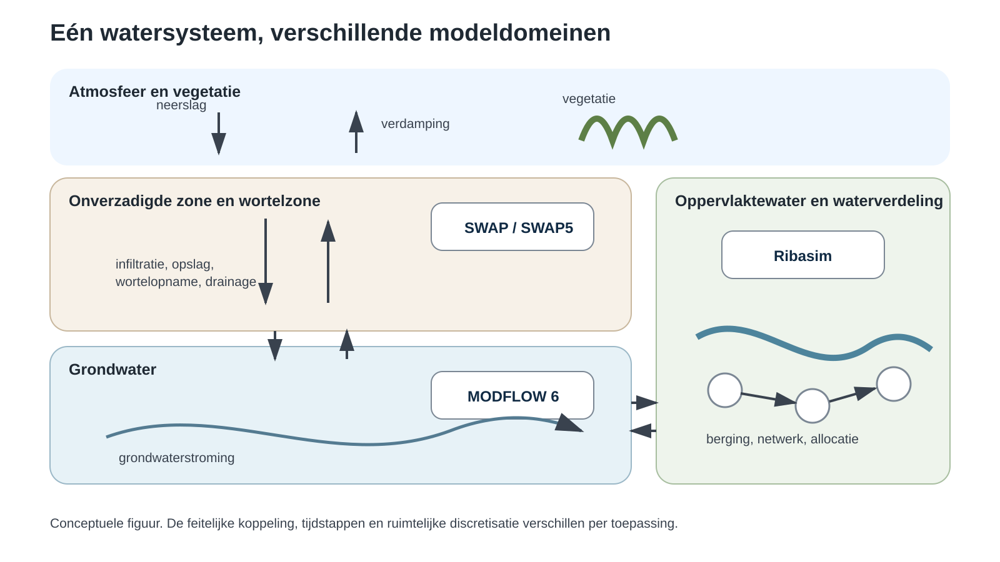
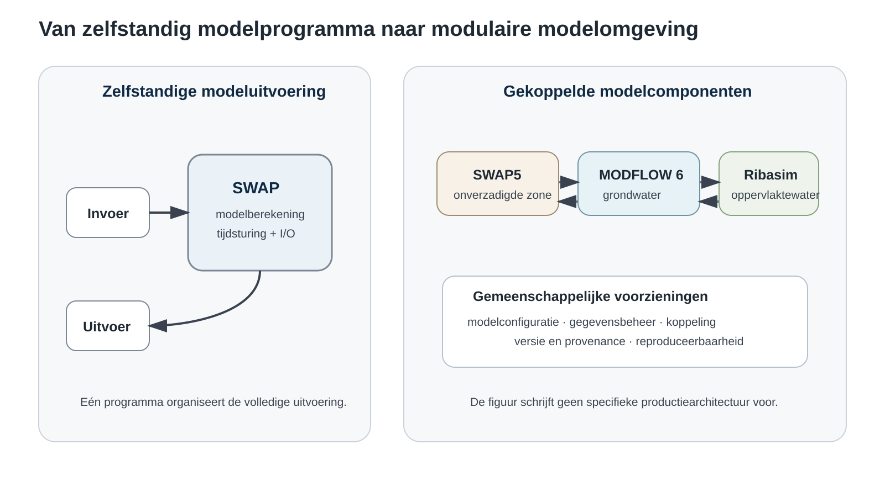
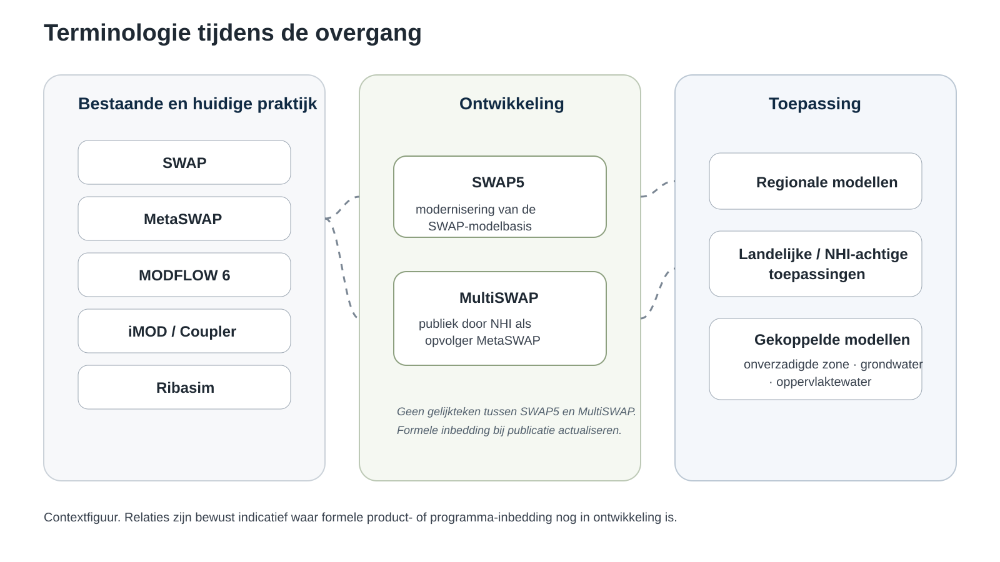
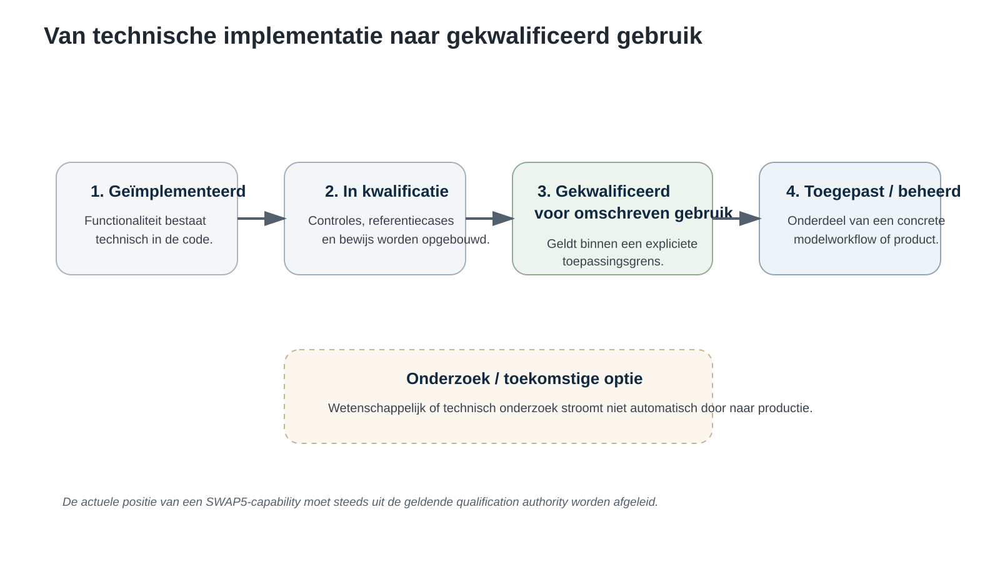

# Stromingen manuscript

## Werkstatus

Derde werkversie, redactioneel herschreven voor Stromingen, voorzien van canonical-evidence status en gecontroleerd tegen de publicatie-firewall. Niet voor indiening.

**Voorlopige penvoerder:** Ab Veldhuizen. **Coauteurs:** vast te stellen op basis van inhoudelijke bijdrage en goedkeuring van de uiteindelijke scope. Actuele claims over het Nederlandse instrumentarium zijn gecontroleerd op 19 september 2026. De statusparagraaf over SWAP5 moet vlak voor indiening opnieuw worden opgebouwd uit de dan geldende canonical qualification authority.

# SWAP in een veranderend hydrologisch instrumentarium

## Modernisering van de onverzadigde zone naast MODFLOW 6 en Ribasim

## Waarom het instrumentarium verandert

Een regionaal hydrologisch model is steeds minder één programma dat van invoer naar uitvoer rekent. Neerslag en verdamping werken door in bodemvocht en gewasverdamping, de onverzadigde zone wisselt water uit met het grondwater, en grondwater staat weer in verbinding met oppervlaktewater en waterverdeling. Wie het watersysteem als geheel wil beschrijven, moet daarom steeds vaker verschillende gespecialiseerde modellen tijdens dezelfde berekening laten samenwerken.

Die modellen zijn historisch niet als één systeem ontstaan. Voor de onverzadigde zone, het grondwater en het oppervlaktewater zijn afzonderlijke modelcodes ontwikkeld, met ieder hun eigen numerieke aanpak, ruimtelijke schematisatie en toepassingsgeschiedenis. Dat heeft veel hydrologische kennis en bruikbare software opgeleverd. Tegelijk verschuift een deel van de modelvraag naar de grenzen tussen die onderdelen: welke informatie wisselen ze uit, op welke schaal gebeurt dat en hoe weet je dat de combinatie nog de hydrologie beschrijft die je denkt te berekenen?

Juist daar verandert het Nederlandse hydrologische instrumentarium op dit moment zichtbaar. Binnen het NHI zijn eind 2025 stabiele releases opgeleverd van iMOD Python voor de opbouw van MODFLOW 6-modellen en van de iMOD Coupler voor de koppeling tussen MODFLOW 6 en MetaSWAP. Ook voor Ribasim kwam een stabiele release beschikbaar. Het NHI positioneert Ribasim als basis voor de verdere vervanging van oudere oppervlaktewatermodules als MOZART, DM en SIMRES. Regionale waterbeheerders passen Ribasim inmiddels ook samen met MODFLOW 6 toe [1].

Het beeld dat daarbij ontstaat is niet dat één nieuw model alle hydrologie overneemt. Eerder worden gespecialiseerde modelcomponenten duidelijker afgebakend en vervolgens expliciet met elkaar verbonden. MODFLOW 6 beschrijft het grondwater. Ribasim richt zich op waterbalans, netwerk en waterverdeling in het oppervlaktewatersysteem [2]. Voor de onverzadigde zone bestaat in Nederland een lange traditie rond SWAP en MetaSWAP. Ook daar vindt nu een overgang plaats.

Dit artikel beschrijft die ontwikkeling vanuit SWAP, niet om nieuwe onderzoeksresultaten vooruit te lopen, maar om te laten zien waarom de SWAP-modelbasis wordt gemoderniseerd, hoe dat past bij MODFLOW 6 en Ribasim en welke nieuwe eisen ontstaan wanneer afzonderlijke hydrologische modellen onderdelen worden van één gekoppeld instrumentarium.

*Figuur 1. De hydrologische domeinen die in een gekoppeld instrumentarium samenkomen. SWAP/SWAP5 beschrijft de onverzadigde zone en vegetatiewaterhuishouding, MODFLOW 6 het grondwater en Ribasim het oppervlaktewatersysteem en de waterverdeling. De figuur is conceptueel; de feitelijke koppeling en ruimtelijke discretisatie verschillen per toepassing.*

## Vijftig jaar SWAP, maar een andere modelomgeving

SWAP kent een lange ontwikkeling. De oorsprong van Soil Water Atmosphere Plant ligt in onderzoek uit de jaren zeventig. In 2024 werd het vijftigjarig bestaan van het model gevierd. In Stromingen is daar in 2025 uitgebreid op teruggeblikt [3]. In die halve eeuw ontwikkelde SWAP zich tot een procesgebaseerd model voor verticale waterbeweging in de onverzadigde zone, in samenhang met onder meer verdamping, gewasontwikkeling, wortelwateropname, drainage en interactie met grondwater.

Die lange geschiedenis is een kracht. Veel processen zijn in de loop van tientallen jaren ontwikkeld, beschreven, getest en in uiteenlopende toepassingen gebruikt. Maar de omgeving waarin hydrologische modellen moeten functioneren is in dezelfde periode sterk veranderd.

Een model was lange tijd vooral een zelfstandig programma: invoer gereedmaken, berekening starten en uitvoer analyseren. Voor veel huidige toepassingen is dat niet meer genoeg. Een model moet onderdeel kunnen worden van een grotere modelketen. Berekeningen moeten reproduceerbaar zijn. Onderdelen moeten afzonderlijk getest kunnen worden. Een simulatie moet kunnen worden hervat. En wanneer twee modellen tijdens dezelfde simulatie informatie uitwisselen, moet duidelijk zijn welke grootheden worden uitgewisseld en welke versie en configuratie van de componenten daarbij zijn gebruikt.

Dat is de achtergrond van SWAP5. Het gaat niet in de eerste plaats om het toevoegen van één nieuw hydrologisch proces. De bestaande procesmatige modelbasis wordt zo georganiseerd dat de wetenschappelijke rekenkern minder afhankelijk is van de historische manier waarop invoer, uitvoering en uitvoer in één programma zijn samengebracht.

Dat klinkt softwarematig, maar het hydrologische belang wordt zichtbaar zodra SWAP onderdeel wordt van een gekoppelde berekening. Dan moet een grondwatermodel een bodemkolom kunnen beïnvloeden zonder de interne opbouw van SWAP te hoeven kennen. Omgekeerd moet de reactie van de onverzadigde zone op een eenduidige manier beschikbaar kunnen komen voor de andere componenten. Hetzelfde geldt voor herstart, reproduceerbaarheid en diagnose van een berekening.

*Figuur 2. Schematische verschuiving van een zelfstandige modeluitvoering naar een modulaire modelomgeving. De modernisering maakt de SWAP-modelbasis beter afzonderlijk aanstuurbaar en koppelbaar, zonder dat deze figuur een specifieke productiearchitectuur voorschrijft.*

De Nederlandse ontwikkeling rond de opvolging van MetaSWAP past in die bredere verandering. Het NHI meldde in 2025 dat WENR en Deltares werken aan een nieuwe onverzadigde-zonemodule op basis van SWAP, waarbij zowel procesdetail als rekentijd voor grootschalige toepassingen een rol spelen [4]. In 2026 wordt MultiSWAP in de publieke NHI-communicatie expliciet aangeduid als opvolger van MetaSWAP [5]. Tegelijk blijft MetaSWAP onderdeel van bestaande en actuele gekoppelde toepassingen. De overgang is dus geen simpele naamswijziging en SWAP5, MultiSWAP en MetaSWAP zijn niet zonder nadere context als synoniemen te gebruiken.

## Van modelprogramma naar modelcomponent

De belangrijkste verandering is misschien het best te begrijpen door niet naar de code te kijken, maar naar de rol die SWAP in een berekening kan krijgen.

In een zelfstandige SWAP-berekening ligt de gehele uitvoering binnen één modelprogramma. Atmosferische randvoorwaarden, bodem- en gewaseigenschappen en onderrandvoorwaarden worden ingevoerd, het model doorloopt de simulatie en de resultaten worden vervolgens uitgelezen. In een gekoppelde toepassing kan een deel van die omgeving tijdens de berekening zelf veranderen. Een grondwatercomponent kan bijvoorbeeld informatie leveren over de toestand aan de onderzijde van het bodemprofiel, waarna de onverzadigde-zonecomponent daarop reageert en relevante waterfluxen teruggeeft.

Hydrologisch is die wisselwerking vanzelfsprekend. Een veranderende grondwaterstand beïnvloedt de vochttoestand en de verticale fluxen in het bodemprofiel. Omgekeerd beïnvloeden infiltratie, verdamping, drainage en bodemwaterstroming de hoeveelheid water die het grondwatersysteem bereikt of verlaat. De moeilijkheid zit er niet in dat deze relaties bestaan, maar in het zorgvuldig representeren ervan wanneer twee zelfstandig rekenende modelcomponenten informatie moeten uitwisselen.

SWAP5 wordt daarom zo opgebouwd dat de wetenschappelijke rekenkern, gegevensafhandeling, modeluitvoering en koppeling duidelijker van elkaar zijn te onderscheiden. De precieze numerieke en wetenschappelijke uitwerking van de koppeling valt buiten dit overzicht. Voor de gebruiker is vooral van belang dat de SWAP-modelbasis niet meer uitsluitend verbonden hoeft te zijn aan één vaste uitvoeringsvorm.

Dat sluit aan bij MODFLOW 6. Binnen het huidige NHI-traject wordt MODFLOW 6 steeds nadrukkelijker de grondwaterrekenkern en ondersteunt iMOD Python de opbouw van die modellen. De iMOD Coupler maakt koppeling met andere modelcodes mogelijk [1,6]. Ribasim vult weer een ander deel van het systeem in en beschrijft oppervlaktewater, berging en waterverdeling in een netwerk [2].

*Figuur 3. Context van enkele modelnamen tijdens de huidige overgang. MetaSWAP blijft onderdeel van bestaande gekoppelde toepassingen, terwijl MultiSWAP publiek als opvolger wordt ontwikkeld. SWAP5 verwijst in dit artikel naar de modernisering van de SWAP-modelbasis. De precieze product- en projectinbedding moet bij publicatie worden afgestemd op de dan actuele officiële projectdocumentatie.*

Samen vormen deze ontwikkelingen de bouwstenen voor een instrumentarium waarin verschillende delen van het watersysteem met gespecialiseerde componenten kunnen worden beschreven. Dat betekent niet dat iedere denkbare combinatie al productierijp is. De technische mogelijkheid om componenten met elkaar te verbinden is slechts het begin. De hydrologische betekenis van die verbinding moet voor de betreffende toepassing ook voldoende zijn onderbouwd.

## Koppelen is meer dan pijlen tussen modellen

Een architectuurschema met drie blokken en enkele pijlen is snel getekend. In de praktijk zijn die pijlen precies de plekken waar nieuwe modelvragen ontstaan.

De eerste vraag is welke informatie tussen componenten wordt uitgewisseld. Een grondwatermodel en een onverzadigde-zonemodel beschrijven niet noodzakelijk dezelfde toestandsvariabelen, tijdstappen of ruimtelijke eenheden. Hetzelfde geldt voor een oppervlaktewatermodel. Een koppeling moet daarom niet alleen technisch gegevens kunnen overdragen, maar ook duidelijk maken wat die gegevens hydrologisch betekenen.

Een tweede vraag is schaal. Een SWAP-profiel beschrijft verticale processen voor een locatie of representatieve landeenheid. Een grondwatermodel verdeelt het gebied in ruimtelijke elementen. Ribasim gebruikt een netwerkrepresentatie voor het oppervlaktewatersysteem. Die drie beschrijvingen hoeven niet op dezelfde schaal te werken. Dat hoeft op zichzelf geen probleem te zijn, maar de gekozen schematisatie moet passen bij het doel van de toepassing.

Een derde vraag is tijd. Snelle veranderingen aan het maaiveld, tragere veranderingen in het grondwater en operationele veranderingen in het oppervlaktewatersysteem hoeven niet op dezelfde karakteristieke tijdschaal te verlopen. Een modulair instrumentarium maakt het mogelijk deze verschillen expliciet te behandelen, maar neemt de hydrologische vraag naar een passende koppelingsstrategie niet weg.

Daarom is het nuttig onderscheid te maken tussen koppelbaarheid en geldigheid. Koppelbaarheid betekent dat softwarecomponenten informatie kunnen uitwisselen en gezamenlijk een berekening kunnen uitvoeren. Geldigheid gaat over de vraag of de gekozen representatie voor de beoogde toepassing voldoende is onderbouwd. De eerste is een voorwaarde voor de tweede, maar geen bewijs ervan.

Voor NHI-achtige toepassingen is dat onderscheid relevant. Een flexibel instrumentarium kan verschillende modelopzetten mogelijk maken. Welke opzet passend is, hangt vervolgens af van de onderzoeksvraag, het schaalniveau, beschikbare gegevens, gewenste rekentijd en de processen die voor de toepassing bepalend zijn.

## Implementeren is nog niet kwalificeren

Bij softwareontwikkeling is het verleidelijk om voortgang af te meten aan wat al in de code aanwezig is. Voor een wetenschappelijk model is dat een te eenvoudige maat.

Een nieuwe modelroute kan technisch uitvoerbaar zijn terwijl nog niet voldoende is aangetoond dat zij geschikt is voor de toepassing waarvoor zij bedoeld is. Daarom wordt in de SWAP5-ontwikkeling bewust onderscheid gemaakt tussen implementatie en kwalificatie.

Die kwalificatie kan verschillende vormen aannemen. Geautomatiseerde tests controleren afzonderlijke onderdelen. Referentiecases helpen veranderingen in modelgedrag zichtbaar te maken. Waterbalansen geven informatie over de interne consistentie van een berekening. Gedocumenteerd modelgedrag vormt een aanvullende basis voor vergelijking. Welke combinatie nodig is, hangt af van het onderdeel dat wordt ontwikkeld.

*Figuur 4. In dit artikel wordt onderscheid gemaakt tussen technische implementatie, lopende kwalificatie en gekwalificeerd gebruik. Onderzoek en toekomstige opties vormen een aparte categorie. De actuele positie van afzonderlijke SWAP5-capabilities moet worden ontleend aan de geldende kwalificatiebasis op het moment van publicatie.*

Het onderscheid klinkt administratief, maar voorkomt een wezenlijk misverstand. Een functie die in een ontwikkelbranch aanwezig is, is daarmee nog geen productiemogelijkheid. En een modelcomponent die zelfstandig goed rekent, is niet automatisch gekwalificeerd voor iedere gekoppelde toepassing.

Juist bij een model met een lange geschiedenis is die terughoudendheid nuttig. De bedoeling is niet om de bestaande SWAP-kennis terzijde te schuiven en opnieuw te beginnen. De modernisering moet die kennis bruikbaar maken in een nieuwe softwareomgeving zonder sneller wetenschappelijke zekerheid te claimen dan de beschikbare controles toelaten.

Dat is ook relevant voor de communicatie over SWAP5. In dit artikel wordt daarom onderscheid gemaakt tussen functionaliteit die gekwalificeerd beschikbaar is, functionaliteit waarvan de kwalificatie nog loopt, actieve ontwikkeling en onderzoek dat nog geen productiestatus heeft. De precieze invulling van die vier categorieën moet vlak voor publicatie worden geactualiseerd, omdat de ontwikkeling momenteel snel gaat.

## Detail, rekentijd en toepassing

Voor regionale en landelijke modellering speelt naast procesbeschrijving ook rekentijd een rol. Een gedetailleerde onverzadigde-zoneberekening kan in een grote schematisatie zeer vaak moeten worden uitgevoerd. De publieke NHI-communicatie over de opvolging van MetaSWAP noemt daarom expliciet de behoefte aan verschillende rekenroutes voor toepassingen met uiteenlopende eisen aan detail en snelheid [4].

Daarbij is het weinig zinvol om de discussie terug te brengen tot de tegenstelling 'nauwkeurig' versus 'snel'. Een modelroute moet worden beoordeeld op het doel waarvoor zij wordt gebruikt. Voor sommige toepassingen is veel procesdetail nodig. Voor andere toepassingen kan de ruimtelijke omvang of het aantal scenario's een grotere rol spelen. Een snellere aanpak moet voor het beoogde gebruik worden gevalideerd, terwijl extra detail alleen waarde heeft wanneer het iets bijdraagt aan de vraag die met het model wordt onderzocht.

Een modulaire modelbasis helpt om zulke keuzes explicieter te maken. De hydrologische processen die een model beschrijft, de numerieke route waarmee de berekening wordt uitgevoerd en de manier waarop het model in een grotere toepassing wordt ingezet, hoeven dan minder sterk in één vaste softwarevorm te zijn opgesloten.

Voor gebruikers is dat uiteindelijk belangrijker dan de interne softwarearchitectuur. Het wordt eenvoudiger om vast te leggen welke modelcomponenten en versies zijn gebruikt, onderdelen afzonderlijk te testen en een onverwacht resultaat terug te voeren op een specifieke component of koppeling. Ook wordt beter zichtbaar dat niet iedere toepassing dezelfde combinatie van detail, ruimtelijke schaal en rekentijd vraagt.

Daar hoort ook een minder zichtbaar deel van modelontwikkeling bij. Een bruikbaar nationaal of regionaal instrumentarium bestaat niet alleen uit rekenkernen. Documentatie, referentiecases, versiebeheer, modeldata, testprocedures en afspraken over interfaces zijn minstens zo bepalend voor de vraag of een instrumentarium duurzaam gebruikt kan worden.

## Waar staat SWAP5 nu?

### Kader 1. Momentopname SWAP5, 19 september 2026

Deze momentopname is gebaseerd op de actuele canonical ontwikkellijn en de Production Physics & Application Envelope Gap Audit. Voor publicatie moet het kader opnieuw tegen de dan geldende canonical worden gecontroleerd.

- **Gekwalificeerde kern:** Reference-Richards bodemwaterberekening, committed-boundary restart en serialized real-physics MultiSWAP.
- **Gekwalificeerd maar begrensd:** onder meer bovengrensprocessen, referentieverdamping, Feddes-wortelopname, WOFOST, drainage, oppervlaktewaterberging, sneeuw, bodemtemperatuur en parallelle MultiSWAP-uitvoering binnen omschreven profielen.
- **Grondwaterkoppeling:** een productiegerichte live SWAP5-MODFLOW 6-keten is voor begrensde toepassingen gekwalificeerd; integratie in de daadwerkelijke iMOD Coupler-productdriver blijft een afzonderlijke stap.
- **Nog niet breed als SWAP5-productieroute beschikbaar:** volledige meteorologische/kalenderinvoer, geavanceerde wortelstress, macroporiënstroming, vorst en faseovergangen, hysterese, brede solute-hydraulische interacties, volledige management/tillage en de volledige historische uitvoerfamilie.

De huidige canonical SWAP5-basis is inmiddels veel meer dan een architectuurprototype, maar vertegenwoordigt nog niet de volledige toepassing van SWAP 4.3.1 [7]. Een productie-audit van 18 september 2026 laat juist beide kanten zien: er is een substantiële getypeerde en gekwalificeerde runtime ontstaan, terwijl verschillende historische proces- en invoerroutes nog bewust buiten de normale productieomgeving vallen.

De Reference-Richards bodemwaterkern is als productiecomponent gekwalificeerd. Ook committed-boundary restart, serialized real-physics MultiSWAP en een begrensde parallelle MultiSWAP-route zijn toegelaten. Rond de hoofdrekenkern zijn inmiddels beperkte maar reële productieroutes beschikbaar voor onder meer atmosferische bovengrensprocessen, referentieverdamping, Feddes-wortelopname, WOFOST, drainage, oppervlaktewaterberging, sneeuw en bodemtemperatuur. Het woord beperkt is daarbij belangrijk: de kwalificatie geldt voor omschreven configuraties en niet automatisch voor alle historische SWAP-opties.

Ook de grondwaterkoppeling is verder dan een alleen conceptuele interface. De huidige canonical bevat een productiegerichte SWAP5-MODFLOW 6-keten die voor begrensde live MODFLOW 6-toepassingen is gekwalificeerd. Daarmee kan SWAP5 in een gecontroleerde modelomgeving met een externe grondwaterrekenkern worden uitgevoerd. De stap naar de daadwerkelijke productintegratie in de iMOD Coupler-driver en de bijbehorende productconfiguratie is echter nog een afzonderlijke ontwikkelstap. Een technisch werkende koppeling moet dus niet worden verward met een afgerond landelijk product.

Tegelijk zijn belangrijke delen van de brede SWAP-functionaliteit nog niet als normale SWAP5-productieroute beschikbaar. Dat geldt onder meer voor volledige meteorologische en kalenderinvoer, verschillende geavanceerde wortelstressmechanismen, macroporiënstroming, vorst en faseovergangen, hysterese, brede solute-hydraulische interacties, volledige management- en tillagefunctionaliteit en volledige compatibiliteit met de historische uitvoerfamilie. Voor sommige onderdelen is de wetenschappelijke basis helder maar ontbreekt de nieuwe productieroute; andere vragen eerst aanvullende wetenschappelijke beoordeling.

Deze stand van zaken is juist relevant voor de manier waarop SWAP5 wordt ontwikkeld. Het doel is niet om zo snel mogelijk iedere historische optie onder een nieuwe naam beschikbaar te maken. De nieuwe modelbasis wordt per capability uitgebreid en gekwalificeerd, waarbij beperkingen zichtbaar blijven. Daardoor is beter aan te geven wat daadwerkelijk kan worden toegepast en waar nog onderzoek of migratiewerk nodig is.

## Waar gaat het instrumentarium heen?

Voor het bredere Nederlandse instrumentarium is dezelfde geleidelijke overgang zichtbaar. Het NHI meldde in juni 2026 stabiele releases van iMOD Python en de iMOD Coupler voor MODFLOW 6 en MetaSWAP, en een stabiele release van Ribasim [1]. MultiSWAP wordt publiek gepositioneerd als opvolger van MetaSWAP [5]. Verschillende onderdelen bewegen dus in hun eigen tempo van bestaande praktijk, via ontwikkeling en kwalificatie, naar nieuwe toepassingen.

De interessantste verandering zit niet in een lijst met modelnamen. Belangrijker is dat de onverzadigde zone, het grondwater en het oppervlaktewater steeds duidelijker als afzonderlijke modelcomponenten kunnen worden ontwikkeld en getoetst, terwijl hun onderlinge samenhang expliciet onderdeel wordt van de modelopzet.

Dat levert ook een onderzoeksagenda op. Koppeling, ruimtelijke en temporele schaal, numerieke robuustheid, rekentijd en toepassingen waarin bodem, vegetatie, grondwater en oppervlaktewater sterk op elkaar terugwerken, worden beter afzonderlijk onderzoekbaar. De technische architectuur geeft daar geen antwoorden op. Zij maakt het wel mogelijk om de vragen scherper en reproduceerbaarder te stellen.

Voor de Nederlandse hydrologische praktijk is dat waarschijnlijk de meest relevante verschuiving. Niet dat één model plaatsmaakt voor een ander, maar dat modelkeuzes, componentgrenzen en koppelingen explicieter worden. Daardoor kan ook duidelijker worden aangegeven wat een model voor een bepaalde toepassing wel kan, wat nog moet worden gekwalificeerd en waar verder onderzoek nodig is.

SWAP5 moet in dat verband niet worden gezien als een losstaand softwareproject. Het is onderdeel van een bredere vernieuwing waarin bestaande hydrologische kennis geschikt wordt gemaakt voor een gekoppelde en beter reproduceerbare modelomgeving. Het succes daarvan zal uiteindelijk niet alleen worden bepaald door de vraag of de componenten technisch met elkaar kunnen rekenen, maar vooral door de mate waarin hun gezamenlijke gedrag voor de beoogde toepassingen hydrologisch te onderbouwen is.

## Bronnen voor deze werkversie

[1] NHI (2026). Nieuwe releases voor modelsoftware, 10 juni 2026. https://nhi.nu/nieuwsoverzicht/nieuwe-releases-voor-modelsoftware/

[2] NHI. Ribasim. https://nhi.nu/modelcode/ribasim/

[3] Heinen, M., Mulder, M., Hack-ten Broeke, M., Bartholomeus, R. en Van Dam, J. (2025). SWAP 50 jaar. Stromingen, editie 1, 2025. https://nhv.nu/kennis/stromingen/swap-50-jaar/

[4] NHI (2025). Nieuwe module voor onverzadigde zone, 18 juni 2025. https://nhi.nu/nieuwsoverzicht/nieuwe-module-voor-onverzadigde-zone/

[5] NHI (2026). NHI-webinar #4: MultiSWAP: opvolger van MetaSWAP, 18 maart 2026, vermeld in het NHI-nieuwsoverzicht. https://nhi.nu/nieuwsoverzicht/

[6] NHI. iMOD5 en iMOD Suite. https://nhi.nu/tooling/imod-5-en-imod-suite/

[7] SWAP5 repository. Production Physics & Application Envelope Gap Audit en actuele canonical ontwikkellijn, geraadpleegd 19 september 2026. https://github.com/abhedwig-cell/SWAP5

## Redactionele notities voor indiening

1. De terminologie SWAP5, MultiSWAP en MetaSWAP moet vlak voor indiening worden gereconcilieerd met de actuele project- en publieke authority.
2. De actuele SWAP5-status moet worden ingevuld vanuit de dan geldende canonical kwalificatiebasis.
3. De tekst mag niet worden uitgebreid met P1-resultaten over de transactionele moderniseringsmethodiek.
4. De tekst mag niet worden uitgebreid met PUB-GC-resultaten over koppelsemantiek, response-identiteit, convergentie of whole-window exchange.
5. De schaalparagrafen mogen niet worden uitgebreid met PUB-SG-resultaten over equivalente kolommen of transferability.
6. De paragraaf over rekentijd mag geen P2-, DIFFICULTY- of ROM-resultaten bevatten.
7. Voor indiening moeten alle externe bronnen opnieuw op actualiteit worden gecontroleerd.
